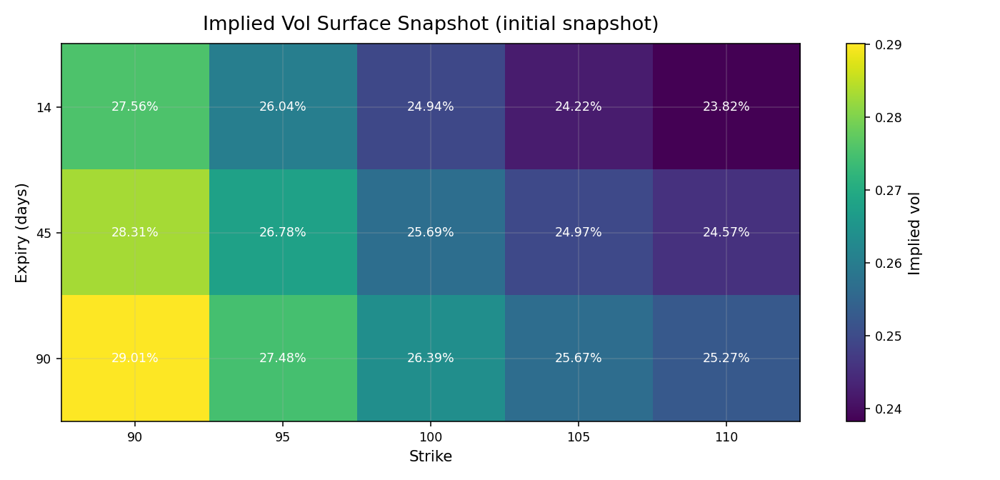
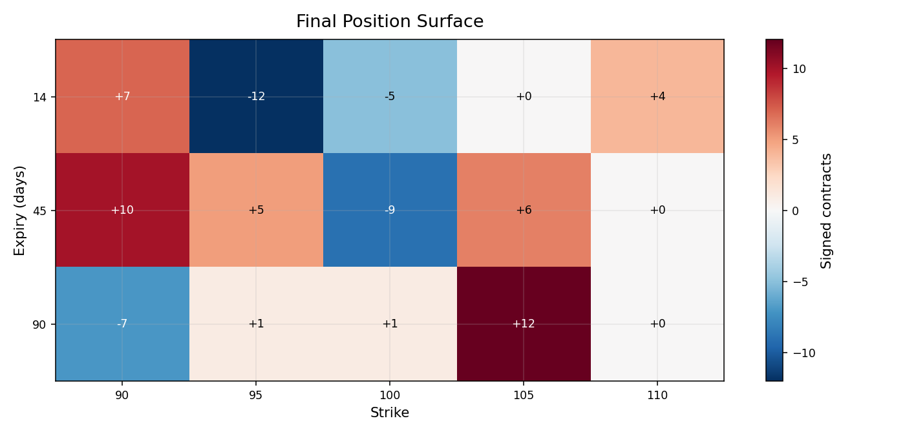
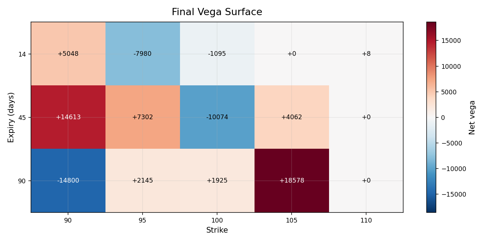
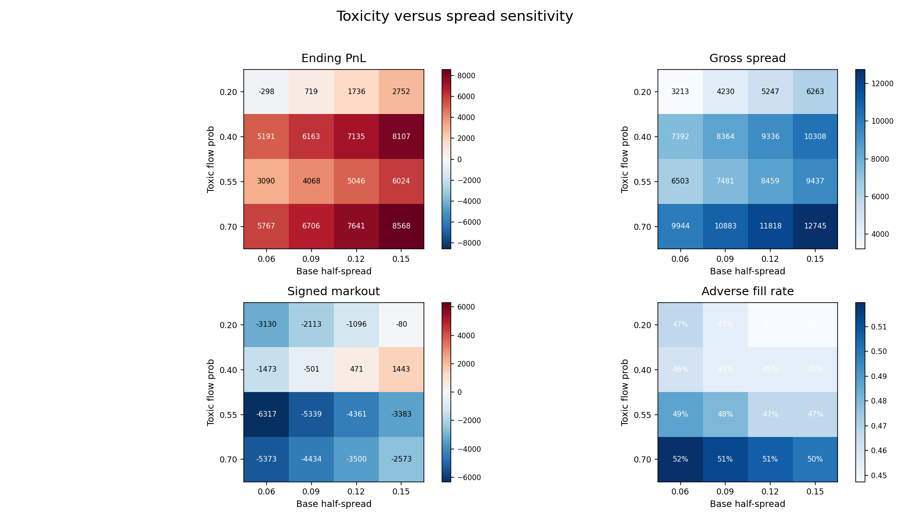
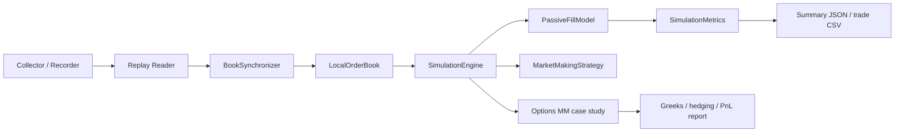

# lob_sim

`lob_sim` is a Python market-making repo built around two interviewer-friendly artifacts: a queue-aware Binance futures replay simulator and a synthetic options dealer case study for fair value, reservation price, half-spread, signed markout, and warehoused vega across the surface.

## What This Is

- Futures: Binance USD-M replay with queue-aware passive fill modelling.
- Options: synthetic dealer pricing and risk case study with Black-Scholes fair value, reservation price, signed markout, delta hedging, and surface risk.
- Outputs: concise markdown briefs, CSV artifacts, and charts built for fast review.

## Start Here for Options Interviewers

Open these three artifacts first:

1. [Committed interview brief](docs/sample_outputs/toxic_flow_seed7/interview_brief.md)
2. [Overview dashboard](docs/sample_outputs/toxic_flow_seed7/overview_dashboard.png)
3. [Scenario matrix](docs/sample_outputs/scenario_matrix_seed7/scenario_matrix.md)

Fastest prep for a live walkthrough: [docs/interview_talk_track.md](docs/interview_talk_track.md)

Quickest Windows launcher:

```bat
run_options_mm_interview_mode.bat
```

Quickest macOS/Linux launcher:

```bash
bash run_options_mm_case.sh
```

Quickest CLI command:

```bash
python -m lob_sim.cli options-demo --scenario toxic_flow --steps 180 --seed 7 --out-dir outputs --brief --interview-mode
```

Sample charts:

[](docs/sample_outputs/toxic_flow_seed7/overview_dashboard.png)
[](docs/sample_outputs/toxic_flow_seed7/implied_vol_surface_snapshot.png)
[](docs/sample_outputs/toxic_flow_seed7/position_surface_heatmap.png)
[](docs/sample_outputs/toxic_flow_seed7/vega_surface_heatmap.png)
[](docs/sample_outputs/scenario_matrix_seed7/scenario_comparison.png)
[](docs/sample_outputs/toxicity_spread_sensitivity_seed7/toxicity_spread_heatmap.png)

Useful follow-up files when running locally:
- `outputs/interview_brief.md`
- `outputs/overview_dashboard.png`
- `outputs/implied_vol_surface_snapshot.png`
- `outputs/position_surface_heatmap.png`
- `outputs/vega_surface_heatmap.png`

## Synthetic vs Real

- The futures side replays recorded Binance USD-M futures data and models queue-aware passive fills.
- The options side is synthetic. It does not replay a live options venue order book.
- That is deliberate: the options module is a dealer pricing and risk artifact, so fair value, reservation price, half-spread, signed markout, and warehoused vega stay easy to inspect.

## Quick Interviewer FAQ

- **Why synthetic?** The options artifact is meant to make dealer pricing and risk legible in a short review. Synthetic flow and a small chain keep fair value, reservation price, signed markout, and hedging easy to audit.
- **Why Black-Scholes?** It is a clean baseline for fair value and Greeks. The point here is transparent dealer logic, not claiming a full smile-dynamics model.
- **What is reservation price?** Reservation price is the inventory-driven shift applied to both bid and ask around fair value. If delta or vega is already leaning the wrong way, the quote moves to make more of that risk less attractive and offsetting flow more attractive.
- **How can gross spread capture be positive while signed markout is negative?** Gross spread capture is the edge earned at the fill in contract dollars. Signed markout asks whether fair value moved for or against the dealer after the trade, so the dealer can earn the spread and still get picked off.
- **What would real data change?** Real data would calibrate the implied-vol surface, customer flow mix, toxic-flow share, signed markout behavior, and hedge-cost assumptions. The repo structure stays the same; the synthetic knobs become desk-calibrated inputs.

## 2-Minute Screen-Share Path

1. `interview_brief.md`
2. `overview_dashboard.png`
3. `implied_vol_surface_snapshot.png`
4. `position_surface_heatmap.png`
5. `vega_surface_heatmap.png`
6. representative fill in `interview_brief.md`
7. `scenario_matrix.md`
8. `toxicity_spread_sensitivity.md`

If you are browsing on GitHub and not running the code, use the committed sample pack in [docs/sample_outputs/toxic_flow_seed7/](docs/sample_outputs/toxic_flow_seed7/).
For the same-seed preset comparison, open [docs/sample_outputs/scenario_matrix_seed7/](docs/sample_outputs/scenario_matrix_seed7/).
For the deterministic spread-versus-toxicity sweep, open [docs/sample_outputs/toxicity_spread_sensitivity_seed7/](docs/sample_outputs/toxicity_spread_sensitivity_seed7/).

## Scenario Comparison

To show that the options demo is regime-sensitive rather than one flattering path, run:

```bash
python -m experiments.run_options_scenario_matrix --steps 180 --seed 7 --out-dir outputs
```

This writes:

- `outputs/scenario_matrix.csv`
- `outputs/scenario_matrix.md`
- `outputs/scenario_comparison.png`

## Toxicity vs Spread Sensitivity

To show one small but trader-relevant economics trade-off, run:

```bash
python -m experiments.run_options_toxicity_spread_sensitivity --steps 180 --seed 7 --out-dir outputs
```

This writes:

- `outputs/toxicity_spread_sensitivity.csv`
- `outputs/toxicity_spread_sensitivity.md`
- `outputs/toxicity_spread_heatmap.png`

## Options Market-Making Case Study

Source code and notes:

- [lob_sim/options/demo.py](lob_sim/options/demo.py)
- [docs/options_mm_demo_guide.md](docs/options_mm_demo_guide.md)
- [docs/interview_talk_track.md](docs/interview_talk_track.md)
- [docs/sanity_checks.md](docs/sanity_checks.md)
- [docs/design_choices.md](docs/design_choices.md)
- [docs/what_real_data_would_change.md](docs/what_real_data_would_change.md)
- [docs/sample_outputs/README.md](docs/sample_outputs/README.md)

The options layer is implemented in:

- [lob_sim/options/black_scholes.py](lob_sim/options/black_scholes.py)
- [lob_sim/options/surface.py](lob_sim/options/surface.py)
- [lob_sim/options/markout.py](lob_sim/options/markout.py)
- [lob_sim/options/demo.py](lob_sim/options/demo.py)
- [experiments/run_options_case_study.py](experiments/run_options_case_study.py)
- [experiments/run_options_scenario_matrix.py](experiments/run_options_scenario_matrix.py)
- [experiments/run_options_toxicity_spread_sensitivity.py](experiments/run_options_toxicity_spread_sensitivity.py)

It simulates:

- a small option chain across strikes and expiries
- Black-Scholes fair value and Greeks
- a simple skewed implied-vol surface
- scenario-driven customer arrivals, side, size, and toxicity
- inventory-aware reservation price shifts from delta and vega exposure
- quote width widening from realized vol and gamma pressure
- delta hedging in the underlying
- realized and unrealized PnL decomposition
- scenario presets for `calm_market`, `volatile_market`, `toxic_flow`, and `inventory_stress`

### Simulation Loop

Each step:

1. Selects one option from the synthetic chain.
2. Builds a quote around fair value.
3. Samples customer flow side, size, and toxicity from the chosen scenario.
4. Applies the fill and updates inventory.
5. Hedges underlying delta if the risk trigger is breached.
6. Evolves underlying spot one step forward.
7. Marks the book and records fills, checkpoints, and path-level PnL.

### Quote Construction

The quote formula is:

`bid = fair_value - half_spread - reservation_price`

`ask = fair_value + half_spread - reservation_price`

Where:

- `fair_value` comes from Black-Scholes using current spot, time to expiry, and implied vol
- `reservation_price` shifts both sides when the dealer already carries too much delta or vega
- `half_spread` compensates for making a market and widens with realized vol and gamma pressure

### Markout Definition

Signed markout is measured against option fair value at a fixed future horizon from the realized simulation path:

`signed_markout = direction * (future_fair_value - fill_price) * qty * contract_size`

- `direction = +1` for a market-maker buy fill
- `direction = -1` for a market-maker sell fill
- positive signed markout is good for the dealer
- negative signed markout indicates adverse selection

### Pricing Surface Used by the Demo

- `implied_vol_surface_snapshot.png` shows the initial synthetic implied-vol surface used to feed Black-Scholes fair value across strike and expiry.
- Vega should be read alongside this surface because delta can be hedged away while surface-specific volatility exposure remains warehoused.
- The surface shape here is parametric and synthetic; real calibration would need live option quotes or trades across the listed surface.

### Output Artifacts

Each options run writes a clean pack into `outputs/`:

- `summary.json`
- `interview_brief.md`
- `demo_report.md`
- `fills.csv`
- `checkpoints.csv`
- `pnl_timeseries.csv`
- `positions_final.csv`
- `overview_dashboard.png`
- `implied_vol_surface_snapshot.png`
- `position_surface_heatmap.png`
- `vega_surface_heatmap.png`
- `pnl_over_time.png`
- `realized_vs_unrealized.png`
- `spot_path.png`
- `inventory_over_time.png`
- `net_delta_over_time.png`
- `markout_distribution.png`
- `toxic_vs_nontoxic_markout.png`
- `top_traded_contracts.png`

A deterministic committed subset for `scenario=toxic_flow`, `steps=180`, `seed=7` lives in [docs/sample_outputs/toxic_flow_seed7/](docs/sample_outputs/toxic_flow_seed7/).

For a same-seed comparison across all current presets, run [experiments/run_options_scenario_matrix.py](experiments/run_options_scenario_matrix.py) and open `outputs/scenario_matrix.md` followed by `outputs/scenario_comparison.png`.

For the spread-versus-toxicity trade-off, run [experiments/run_options_toxicity_spread_sensitivity.py](experiments/run_options_toxicity_spread_sensitivity.py) and open `outputs/toxicity_spread_sensitivity.md`.

For a compact calibration note on what real desk data would change, open [docs/what_real_data_would_change.md](docs/what_real_data_would_change.md).

### How to Run the Options Demo

CLI:

```bash
python -m lob_sim.cli options-demo --scenario toxic_flow --steps 180 --seed 7 --out-dir outputs --brief --interview-mode
python -m lob_sim.cli options-demo --scenario calm_market --steps 360 --out-dir outputs --verbose --log-mode compact
python -m experiments.run_options_case_study --scenario toxic_flow --steps 360 --out-dir outputs
```

Windows launchers:

```bat
run_options_mm_interview_mode.bat
run_options_mm_case.bat
run_options_mm_case.bat outputs 360 7 60 calm_market compact
run_options_mm_quick.bat
run_options_mm_quick.bat toxic_flow outputs 180 7
```

POSIX launcher:

```bash
bash run_options_mm_case.sh
bash run_options_mm_case.sh outputs 360 7 60 calm_market compact
```

The full launcher prints scenario assumptions, compact fill events, checkpoints, and the final summary block. The quick launcher runs a fast preset and prints only the headline metrics and artifact paths.

## Futures Replay Simulator

The futures side of the repo is a microstructure simulator for replaying recorded Binance futures depth and trade data and testing passive market-making logic.

### Data Capture

`python -m lob_sim.cli collect` records four message types into NDJSON:

- `exchangeInfo`
- `snapshot`
- `depthUpdate`
- `aggTrade`

This gives the simulator a deterministic event stream to replay later.

### Replay and Book Reconstruction

`python -m lob_sim.cli replay --file ...` rebuilds the venue book from those files:

- `exchangeInfo` defines tick size and lot size
- `snapshot` seeds the local book
- `depthUpdate` applies incremental depth changes
- `aggTrade` provides actual trade prints

[lob_sim/book/sync.py](lob_sim/book/sync.py) enforces diff continuity. If update IDs break, the replay detects a gap.

### Event-Driven Strategy Simulation

`python -m lob_sim.cli simulate --file ...` runs an event-driven strategy loop in [lob_sim/sim/engine.py](lob_sim/sim/engine.py).

The engine maintains one priority queue of internal events:

- `decision`
- `order_arrival`
- `order_cancel`
- `trade_execution`

For each replay timestamp, the engine:

1. Drains all internal events due before that timestamp.
2. Applies the market record to the reconstructed book.
3. Converts book reductions or trade prints into passive fills in the matching model.
4. Feeds those fills back through the same event queue as `trade_execution`.
5. Updates PnL, inventory, markouts, and kill-switch state.

This means the book evolves tick by tick, not in batch.

### Matching Engine

[lob_sim/sim/fill_model.py](lob_sim/sim/fill_model.py) stores price levels as FIFO queues:

- `dict[symbol][side][price_tick] -> deque[Order]`

That gives explicit exchange mechanics:

- price-time priority
- `limit`, `market`, and `cancel` order handling
- queue-ahead tracking
- partial fills
- best bid / ask lookup
- depth-level snapshots

Strategy orders and venue liquidity live in the same queue model, so queue position matters directly.

### Strategy Layer

[lob_sim/sim/mm_strategy.py](lob_sim/sim/mm_strategy.py) decides quotes by:

- reading the live best bid and ask from the local book
- computing midprice
- widening spread as short-horizon realized volatility rises
- skewing quotes when inventory builds
- canceling and reposting when queue-ahead size deteriorates

### Metrics and Outputs

[lob_sim/sim/metrics.py](lob_sim/sim/metrics.py) tracks:

- realized and unrealized PnL
- fill count and fill rate
- queue-ahead statistics
- inventory path
- adverse selection markouts
- regime performance buckets

Simulation outputs are written as JSON summary plus trade CSV.

### How to Run the Futures Simulator

Default public-market-data settings live in `.env.example`.

```bash
python -m lob_sim.cli --env .env.example collect
python -m lob_sim.cli --env .env.example replay --file data/raw_....ndjson
python -m lob_sim.cli --env .env.example simulate --file data/raw_....ndjson
```

Windows batch runner:

```bat
run_futures_scenario.bat
run_futures_scenario.bat data\raw_....ndjson 5000
```

### Experiment Sweeps

```bash
python -m experiments.run_experiments --file data/raw_....ndjson --env .env.example
```

This writes CSV and PNG files to `experiments/output`.

## Architecture



## Limitations

- The futures queue model is explicit but still an approximation of venue-only participant behaviour.
- The options case study is synthetic rather than venue-calibrated; it is meant to show pricing, inventory, hedging, and risk logic clearly.
- The repo is a research and demo artifact rather than production exchange infrastructure.
