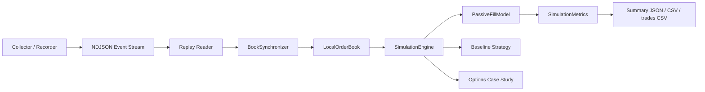

# lob_sim

lob_sim is a deterministic Binance USD-M L2 replay and queue-aware passive-fill simulator, plus a controlled dealer-pricing case study for reservation price, inventory skew, signed markout, and hedging logic.

## Overview

The repo has two artifacts:

- A futures core that records public Binance USD-M market data, reconstructs the local book from snapshots and depth diffs, and replays that stream through an event-driven queue-aware passive-fill simulation.
- A controlled options case study that keeps pricing and inventory logic explicit instead of claiming venue-calibrated options microstructure.

### Why this stands out

- Event-time replay rather than bar backtest.
- Explicit book reconstruction from `exchangeInfo`, `snapshot`, `depthUpdate`, and `aggTrade`.
- Queue-aware passive-fill simulation with FIFO price-time assumptions and queue-ahead tracking.
- Deterministic artifacts and reproducible runs from recorded NDJSON inputs.
- Explicit assumptions, validation notes, and limitations instead of hidden realism claims.

## What Is Implemented

### Futures replay core

- Market-data capture into NDJSON via [`lob_sim/cli.py`](lob_sim/cli.py) and [`lob_sim/record/writer.py`](lob_sim/record/writer.py).
- Snapshot seeding plus diff-continuity checks in [`lob_sim/book/sync.py`](lob_sim/book/sync.py).
- Local book reconstruction in [`lob_sim/book/local_book.py`](lob_sim/book/local_book.py).
- Event-driven replay and offline simulation in [`lob_sim/replay/runner.py`](lob_sim/replay/runner.py) and [`lob_sim/sim/engine.py`](lob_sim/sim/engine.py).
- Queue-aware passive-fill attribution in [`lob_sim/sim/fill_model.py`](lob_sim/sim/fill_model.py).
- PnL, inventory, markout, queue, and kill-switch metrics in [`lob_sim/sim/metrics.py`](lob_sim/sim/metrics.py).

### Controlled options case study

- Black-Scholes fair value, reservation price, half-spread, signed markout, inventory skew, and delta hedging in [`lob_sim/options/demo.py`](lob_sim/options/demo.py).
- Deterministic committed sample outputs under [`docs/sample_outputs/`](docs/sample_outputs/).
- Same-seed scenario comparison and spread-vs-toxicity sensitivity sweeps in [`experiments/`](experiments/).

## Futures Replay Internals

- The collector writes a deterministic event stream of `exchangeInfo`, `snapshot`, `depthUpdate`, and `aggTrade` records to NDJSON.
- The replay path consumes that same recorded stream; there is no separate replay-only data format.
- Snapshot seeding uses the REST snapshot as the local book baseline, then requires the first accepted diff to cover the snapshot update id.
- Diff continuity is enforced with Binance USD-M `U`, `u`, and `pu` semantics; gap handling is explicit rather than patched over.
- With `RESYNC_ON_GAP=1`, live collection re-snapshots on continuity failure. Offline replay and simulation do not fabricate missing updates.
- The simulation engine drains internal events in timestamp order before and after each market record, so decisions, order arrivals, cancels, and trade executions stay in one event-time timeline.

Run the futures paths with:

```bash
python -m lob_sim.cli --env .env.example collect
python -m lob_sim.cli --env .env.example replay --file data/raw_....ndjson
python -m lob_sim.cli --env .env.example simulate --file data/raw_....ndjson
```

For feed-specific details, open [docs/binance_usdm_feed_semantics.md](docs/binance_usdm_feed_semantics.md).



## Matching Model

- [`lob_sim/sim/fill_model.py`](lob_sim/sim/fill_model.py) stores each price level as an explicit FIFO queue.
- Snapshot seeding loads visible venue depth as resting queue ahead of any strategy order at that level.
- Depth reductions consume the front of the queue before later arrivals, which is the core price-time assumption behind passive fills.
- Depth increases append new venue liquidity to the back of the queue at that price.
- `aggTrade` prints are used as an additional observed signal that queue was consumed at the traded price.
- Queue-ahead tracking is explicit: a resting strategy order only fills after the visible queue in front of it has been reduced.

See [docs/futures_validation.md](docs/futures_validation.md) for the assumptions that are currently tested.

## Strategy Layer (Baseline)

The strategy layer is deliberately baseline logic on top of a stronger replay and matching core. It is not presented as sophisticated alpha.

- Quotes are derived from the current best bid, best ask, and mid.
- Half-spread widens with short-horizon realized volatility.
- Inventory skew moves quotes away from accumulating too much position.
- Queue-based refresh logic reposts when queue-ahead deterioration or price movement makes the current quote stale.
- Max-position and kill-switch controls are explicit constraints, not optimization claims.

The baseline remains the default. An opt-in `layered_mm` profile adds two quote levels per side plus a simple imbalance gate; see [docs/futures_strategy_profiles.md](docs/futures_strategy_profiles.md) and the committed-input comparison in [docs/strategy_results/futures_strategy_profile_reference.md](docs/strategy_results/futures_strategy_profile_reference.md).

## Metrics and Outputs

The futures simulation writes:

- `summary_<stem>.json`
- `summary_<stem>.csv`
- `trades_<stem>.csv`

Tracked metrics include:

- realized and unrealized PnL
- average spread captured
- fill rate and fill-from-top rate
- queue-fill count and max queue ahead
- 1-second adverse markout statistics
- inventory mean and variability
- regime-bucket performance
- kill-switch state and reason

Validation notes live in [docs/futures_validation.md](docs/futures_validation.md). Benchmark scope and the published reference run live in [docs/futures_benchmarks.md](docs/futures_benchmarks.md), raw benchmark output is in [docs/benchmark_results/futures_replay_reference.md](docs/benchmark_results/futures_replay_reference.md), and the lightweight runner lives in [experiments/benchmark_futures_replay.py](experiments/benchmark_futures_replay.py).

Committed futures walkthrough artifacts:

- Pack entry: [docs/sample_outputs/futures_replay_walkthrough/README.md](docs/sample_outputs/futures_replay_walkthrough/README.md)
- Summary: [docs/sample_outputs/futures_replay_walkthrough/summary.json](docs/sample_outputs/futures_replay_walkthrough/summary.json)
- Trades: [docs/sample_outputs/futures_replay_walkthrough/trades.csv](docs/sample_outputs/futures_replay_walkthrough/trades.csv)
- Notes: [docs/sample_outputs/futures_replay_walkthrough/walkthrough.md](docs/sample_outputs/futures_replay_walkthrough/walkthrough.md)
- Recorded clip case: [docs/sample_outputs/futures_recorded_clip_case/README.md](docs/sample_outputs/futures_recorded_clip_case/README.md)

## Limitations

- Passive fills are inferred from public depth changes and `aggTrade` prints; they are not private exchange execution reports.
- Queue position is modeled at the visible price level, not from participant-level order identifiers.
- Offline replay does not reconstruct missing diffs after a gap; it reports the continuity failure and avoids inventing data.
- The strategy layer is a baseline quoting/control policy intended to exercise the replay and matching core.
- The repo is technical infrastructure and controlled case-study code, not a production venue gateway or production trading stack.

## Options Case Study

The second artifact is a controlled dealer-pricing case study. It is there to make fair value, reservation price, half-spread, signed markout, inventory skew, and hedging logic inspectable under fixed assumptions.

### Why synthetic / what real data would change

- The options artifact is synthetic by design so the pricing and risk logic stays legible.
- It is not a claim of venue-calibrated options microstructure or exchange-realistic options matching.
- Real data would primarily change flow calibration, surface fitting, markout behavior, and hedge-cost assumptions.

For the detailed calibration map, open [docs/what_real_data_would_change.md](docs/what_real_data_would_change.md).

### Commands and sample outputs

Neutral wrappers:

```bat
run_options_case_study.bat
```

```bash
bash run_options_case_study.sh
```

Existing launchers are still supported:

```bat
run_options_mm_case.bat
run_options_mm_walkthrough_mode.bat
```

CLI:

```bash
python -m lob_sim.cli options-demo --scenario toxic_flow --steps 180 --seed 7 --out-dir outputs --brief --walkthrough-mode
python -m experiments.run_options_scenario_matrix --steps 180 --seed 7 --out-dir outputs
python -m experiments.run_options_toxicity_spread_sensitivity --steps 180 --seed 7 --out-dir outputs
```

Committed artifacts:

- Controlled case-study pack: [docs/sample_outputs/toxic_flow_seed7/](docs/sample_outputs/toxic_flow_seed7/)
- Scenario matrix: [docs/sample_outputs/scenario_matrix_seed7/scenario_matrix.md](docs/sample_outputs/scenario_matrix_seed7/scenario_matrix.md)
- Sensitivity sweep: [docs/sample_outputs/toxicity_spread_sensitivity_seed7/toxicity_spread_sensitivity.md](docs/sample_outputs/toxicity_spread_sensitivity_seed7/toxicity_spread_sensitivity.md)
- Options walkthrough notes: [docs/options_mm_demo_guide.md](docs/options_mm_demo_guide.md)
- Options case study notes: [docs/options_case_study_notes.md](docs/options_case_study_notes.md)

## Walkthrough Path

Start with [WALKTHROUGH.md](WALKTHROUGH.md).

Technical read, then zero-click futures artifacts, then the options case study:

1. `README.md`
2. `docs/binance_usdm_feed_semantics.md`
3. `docs/futures_validation.md`
4. `docs/sample_outputs/futures_replay_walkthrough/README.md`
5. `docs/sample_outputs/futures_replay_walkthrough/summary.json`
6. `docs/sample_outputs/futures_replay_walkthrough/trades.csv`
7. `docs/sample_outputs/futures_replay_walkthrough/walkthrough.md`
8. `docs/sample_outputs/futures_recorded_clip_case/README.md`
9. `docs/sample_outputs/toxic_flow_seed7/case_brief.md`
10. `docs/sample_outputs/scenario_matrix_seed7/scenario_matrix.md`
11. `docs/options_case_study_notes.md`

If you are browsing on GitHub and not running the code, start with [docs/sample_outputs/futures_replay_walkthrough/README.md](docs/sample_outputs/futures_replay_walkthrough/README.md).
Then open the recorded-data check in [docs/sample_outputs/futures_recorded_clip_case/README.md](docs/sample_outputs/futures_recorded_clip_case/README.md).
Then use the committed options case-study pack in [docs/sample_outputs/toxic_flow_seed7/](docs/sample_outputs/toxic_flow_seed7/).
For the same-seed comparison, open [docs/sample_outputs/scenario_matrix_seed7/](docs/sample_outputs/scenario_matrix_seed7/).
For the deterministic spread-versus-toxicity sweep, open [docs/sample_outputs/toxicity_spread_sensitivity_seed7/](docs/sample_outputs/toxicity_spread_sensitivity_seed7/).
