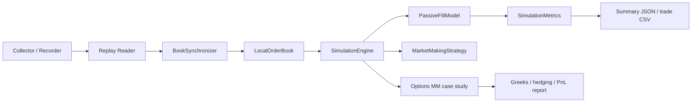

# lob_sim

`lob_sim` is a Python research repo for:

- Binance USD-M futures order-book replay
- explicit event-driven matching and queue-position modelling
- market-making strategy experiments
- an options market-making case study with Greeks, hedging, toxic flow, and PnL decomposition

The repo is not meant to be production infrastructure. It is meant to show trader-relevant thinking in a way that is easy to run, inspect, and explain.

## What the core simulator does

The repo has two related pieces:

1. A microstructure simulator for replaying recorded Binance futures depth/trade data and testing a passive market-making strategy.
2. An options market-maker case study that demonstrates fair value, inventory-aware quoting, risk warehousing, and delta hedging.

## How the futures simulator works exactly

### Data capture

`python -m lob_sim.cli collect` records four message types into NDJSON:

- `exchangeInfo`
- `snapshot`
- `depthUpdate`
- `aggTrade`

This gives the simulator a deterministic event stream to replay later.

### Replay and book reconstruction

`python -m lob_sim.cli replay --file ...` rebuilds the venue book from those files:

- `exchangeInfo` defines tick size and lot size
- `snapshot` seeds the local book
- `depthUpdate` applies incremental depth changes
- `aggTrade` provides actual trade prints

`lob_sim/book/sync.py` enforces diff continuity. If update IDs break, the replay detects a gap.

### Event-driven strategy simulation

`python -m lob_sim.cli simulate --file ...` runs an event-driven strategy loop in [lob_sim/sim/engine.py](/C:/bitbucket/kibert/lob_sim/lob_sim/sim/engine.py).

The engine maintains one priority queue of internal events:

- `decision`
- `order_arrival`
- `order_cancel`
- `trade_execution`

For each replay timestamp, the engine:

1. Drains all internal events due before that timestamp.
2. Applies the market record to the reconstructed book.
3. Converts book reductions or trade prints into passive fills in the matching model.
4. Feeds those fills back through the same event queue as `trade_execution`.
5. Updates PnL, inventory, markouts, and kill-switch state.

This means the book evolves tick by tick, not in batch.

### Matching engine

[lob_sim/sim/fill_model.py](/C:/bitbucket/kibert/lob_sim/lob_sim/sim/fill_model.py) stores price levels as FIFO queues:

- `dict[symbol][side][price_tick] -> deque[Order]`

That gives explicit exchange mechanics:

- price-time priority
- `limit`, `market`, and `cancel` order handling
- queue-ahead tracking
- partial fills
- best bid / ask lookup
- depth-level snapshots

Strategy orders and venue liquidity live in the same queue model, so queue position matters directly.

### Strategy layer

[lob_sim/sim/mm_strategy.py](/C:/bitbucket/kibert/lob_sim/lob_sim/sim/mm_strategy.py) decides quotes by:

- reading the live best bid / ask from the local book
- computing midprice
- widening spread as short-horizon realized volatility rises
- skewing quotes when inventory builds
- canceling and reposting when queue-ahead size deteriorates

### Metrics and outputs

[lob_sim/sim/metrics.py](/C:/bitbucket/kibert/lob_sim/lob_sim/sim/metrics.py) tracks:

- realized and unrealized PnL
- fill count and fill rate
- queue-ahead statistics
- inventory path
- adverse selection markouts
- regime performance buckets

Simulation outputs are written as JSON summary plus trade CSV.

## Why the options extension matters

The futures simulator proves exchange and execution understanding. For options, that is only part of the story. A reviewer will also want to see:

- option fair value and Greeks
- volatility-surface thinking
- inventory-aware quoting
- toxic flow and adverse selection
- delta hedging and hedge costs
- realized versus unrealized PnL

To make that visible, the repo includes a compact options market-making case study.

## Options market-making case study

The options layer is implemented in:

- [lob_sim/options/black_scholes.py](/C:/bitbucket/kibert/lob_sim/lob_sim/options/black_scholes.py)
- [lob_sim/options/surface.py](/C:/bitbucket/kibert/lob_sim/lob_sim/options/surface.py)
- [lob_sim/options/markout.py](/C:/bitbucket/kibert/lob_sim/lob_sim/options/markout.py)
- [lob_sim/options/demo.py](/C:/bitbucket/kibert/lob_sim/lob_sim/options/demo.py)
- [experiments/run_options_case_study.py](/C:/bitbucket/kibert/lob_sim/experiments/run_options_case_study.py)

This is a synthetic dealer study, not a live options venue replay. It simulates:

- a small option chain across strikes and expiries
- Black-Scholes fair value and Greeks
- a simple skewed implied-vol surface
- scenario-driven customer arrivals, side, size, and toxicity
- reservation pricing from delta and vega inventory
- quote width widening from realized vol and gamma pressure
- delta hedging in the underlying
- realized and unrealized PnL decomposition
- scenario presets for `calm_market`, `volatile_market`, `toxic_flow`, and `inventory_stress`

### The simulation loop

Each step does the following:

1. Select one option from the synthetic chain.
2. Build a quote around fair value.
3. Sample customer flow side, size, and toxicity from the scenario.
4. Apply the fill and update inventory.
5. Hedge underlying delta if the risk trigger is breached.
6. Move underlying spot one step forward.
7. Mark the book and record fills, checkpoints, and path-level PnL.

### Quote construction

The quote formula is:

`bid = fair_value - half_spread - reservation_price`

`ask = fair_value + half_spread - reservation_price`

Where:

- `fair_value` comes from Black-Scholes using current spot, time to expiry, and implied vol
- `reservation_price` shifts both sides when the dealer already carries too much delta or vega
- `half_spread` compensates for making a market and widens with realized vol and gamma pressure

### Markout definition

Signed markout is measured against the option fair value at a fixed future horizon from the realized simulation path:

`signed_markout = direction * (future_fair_value - fill_price) * qty * contract_size`

- `direction = +1` for a market-maker buy fill
- `direction = -1` for a market-maker sell fill
- positive signed markout is good for the dealer
- negative signed markout indicates adverse selection

### Output artifacts

Each options run writes a clean pack into `outputs/`:

- `summary.json`
- `demo_report.md`
- `fills.csv`
- `checkpoints.csv`
- `pnl_timeseries.csv`
- `positions_final.csv`
- `pnl_over_time.png`
- `realized_vs_unrealized.png`
- `spot_path.png`
- `inventory_over_time.png`
- `net_delta_over_time.png`
- `markout_distribution.png`
- `toxic_vs_nontoxic_markout.png`
- `top_traded_contracts.png`

If you want the best file to send or attach after a run, start with [docs/options_mm_demo_guide.md](/C:/bitbucket/kibert/lob_sim/docs/options_mm_demo_guide.md) and `outputs/demo_report.md`.

## How to run

### Futures replay simulator

```bash
python -m lob_sim.cli --env .env collect
python -m lob_sim.cli --env .env replay --file data/raw_....ndjson
python -m lob_sim.cli --env .env simulate --file data/raw_....ndjson
```

Windows batch runner:

```bat
run_futures_scenario.bat
run_futures_scenario.bat data\raw_....ndjson 5000
```

### Experiment sweeps

```bash
python -m experiments.run_experiments --file data/raw_....ndjson --env .env
```

This writes CSV and PNG files to `experiments/output`.

### Options MM case study

```bash
python -m lob_sim.cli options-demo --scenario calm_market --steps 360 --out-dir outputs
python -m lob_sim.cli options-demo --scenario calm_market --steps 360 --out-dir outputs --verbose --log-mode compact
python -m experiments.run_options_case_study --scenario toxic_flow --steps 360 --out-dir outputs
```

Windows batch runner:

```bat
run_options_mm_case.bat
run_options_mm_case.bat outputs 360 7 60 calm_market compact
run_options_mm_quick.bat
run_options_mm_quick.bat toxic_flow outputs 180 7
```

The full launcher prints scenario assumptions, compact fill events, checkpoints, and the final summary block. The quick launcher runs a fast preset and prints only the highest-signal metrics plus a short interpretation.

## One-click demo flow

If you want the cleanest Windows run:

1. Double-click `run_options_mm_case.bat`.
2. Wait for the case study to finish.
3. Open `outputs/demo_report.md`.
4. Open `outputs/fills.csv`.
5. Open `outputs/pnl_timeseries.csv`.
6. Open `outputs/pnl_over_time.png`.

If you want a fast high-level run first, use `run_options_mm_quick.bat`.

## Options MM concepts demonstrated

The options demo is designed to make these points easy to explain:

- fair value is set from Black-Scholes on a skewed vol surface
- quotes are shifted by reservation pricing when delta and vega inventory build
- spreads widen when realized vol or gamma risk increases
- toxic flow is tracked through fixed-horizon signed markout / adverse selection
- hedge trades reduce delta when the book breaches its risk threshold
- PnL is split into realized edge and unrealized inventory effects

## What to pay attention to in the outputs

Open these files in order:

- `demo_report.md`: scenario overview, parameter choices, interpretation, glossary, and artifact reading order
- `fills.csv`: trade-by-trade view of spot, fair value, quote, fill price, toxicity, signed markout, delta before and after hedge, and running inventory
- `pnl_timeseries.csv`: path of spot, realized PnL, unrealized PnL, ending PnL, inventory, and net delta through time
- `checkpoints.csv`: the cleaner progress snapshots shown in terminal
- `pnl_over_time.png`, `spot_path.png`, `inventory_over_time.png`, `net_delta_over_time.png`: fast visual summaries for a screen-share

## Architecture



## Limitations

- The futures queue model is explicit but still an approximation of venue-only participant behaviour.
- The options case study is synthetic rather than venue-calibrated; it is meant to show pricing, inventory, hedging, and risk logic clearly.
- The repo is strongest as a research and presentation artifact rather than a production exchange simulator.
