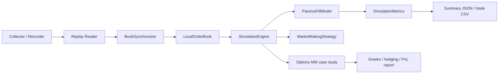

# lob_sim

`lob_sim` is a Python research simulator for:

- Binance USD-M futures order-book replay
- explicit event-driven matching and queue-position modelling
- market-making strategy experiments
- an options market-making case study with Greeks, hedging, and PnL decomposition

## What the core simulator does

The repo has two related pieces:

1. A microstructure simulator for replaying recorded Binance futures depth/trade data and testing a passive market-making strategy.
2. An options market-maker case study that demonstrates fair value, inventory-aware quoting, risk warehousing, and delta hedging.

## How the futures simulator works exactly

### Data capture

`python -m lob_sim.cli collect` records four message types into NDJSON:

- `exchangeInfo`
- `snapshot`
- `depthUpdate`
- `aggTrade`

This gives the simulator a deterministic event stream to replay later.

### Replay and book reconstruction

`python -m lob_sim.cli replay --file ...` rebuilds the venue book from those files:

- `exchangeInfo` defines tick size and lot size
- `snapshot` seeds the local book
- `depthUpdate` applies incremental depth changes
- `aggTrade` provides actual trade prints

`lob_sim/book/sync.py` enforces diff continuity. If update IDs break, the replay detects a gap.

### Event-driven strategy simulation

`python -m lob_sim.cli simulate --file ...` runs an event-driven strategy loop in [lob_sim/sim/engine.py](/C:/bitbucket/kibert/lob_sim/lob_sim/sim/engine.py).

The engine maintains one priority queue of internal events:

- `decision`
- `order_arrival`
- `order_cancel`
- `trade_execution`

For each replay timestamp, the engine:

1. Drains all internal events due before that timestamp.
2. Applies the market record to the reconstructed book.
3. Converts book reductions or trade prints into passive fills in the matching model.
4. Feeds those fills back through the same event queue as `trade_execution`.
5. Updates PnL, inventory, markouts, and kill-switch state.

This means the book evolves tick by tick, not in batch.

### Matching engine

[lob_sim/sim/fill_model.py](/C:/bitbucket/kibert/lob_sim/lob_sim/sim/fill_model.py) stores price levels as FIFO queues:

- `dict[symbol][side][price_tick] -> deque[Order]`

That gives explicit exchange mechanics:

- price-time priority
- `limit`, `market`, and `cancel` order handling
- queue-ahead tracking
- partial fills
- best bid / ask lookup
- depth-level snapshots

Strategy orders and venue liquidity live in the same queue model, so queue position matters directly.

### Strategy layer

[lob_sim/sim/mm_strategy.py](/C:/bitbucket/kibert/lob_sim/lob_sim/sim/mm_strategy.py) decides quotes by:

- reading the live best bid / ask from the local book
- computing midprice
- widening spread as short-horizon realized volatility rises
- skewing quotes when inventory builds
- canceling and reposting when queue-ahead size deteriorates

### Metrics and outputs

[lob_sim/sim/metrics.py](/C:/bitbucket/kibert/lob_sim/lob_sim/sim/metrics.py) tracks:

- realized and unrealized PnL
- fill count and fill rate
- queue-ahead statistics
- inventory path
- adverse selection markouts
- regime performance buckets

Simulation outputs are written as JSON summary plus trade CSV.

## Why the options extension matters

The futures simulator proves exchange and execution understanding. That is useful, but for an options market-making desk it is still incomplete. Traders will want to see that you also understand:

- fair value
- volatility skew / surface thinking
- delta, gamma, and vega inventory
- risk warehousing
- hedge timing and hedge costs
- PnL decomposition after customer flow

To make that visible, the repo now includes an options MM case study.

## Options market-making case study

The options layer is implemented in:

- [lob_sim/options/black_scholes.py](/C:/bitbucket/kibert/lob_sim/lob_sim/options/black_scholes.py)
- [lob_sim/options/surface.py](/C:/bitbucket/kibert/lob_sim/lob_sim/options/surface.py)
- [lob_sim/options/demo.py](/C:/bitbucket/kibert/lob_sim/lob_sim/options/demo.py)
- [experiments/run_options_case_study.py](/C:/bitbucket/kibert/lob_sim/experiments/run_options_case_study.py)

It simulates:

- a small option chain across strikes and tenors
- Black-Scholes fair value and Greeks
- a skewed implied-vol surface
- customer option flow
- inventory-aware reservation pricing
- delta hedging in the underlying
- toxic flow / adverse selection
- decomposition into spread capture, hedge costs, and residual inventory PnL

The output includes:

- `options_mm_summary.json`
- `options_mm_path.csv`
- `options_mm_trades.csv`
- `options_mm_report.png`

## How to run

### Futures replay simulator

```bash
python -m lob_sim.cli --env .env collect
python -m lob_sim.cli --env .env replay --file data/raw_....ndjson
python -m lob_sim.cli --env .env simulate --file data/raw_....ndjson
```

Windows batch runner:

```bat
run_futures_scenario.bat
run_futures_scenario.bat data\raw_....ndjson 5000
```

### Experiment sweeps

```bash
python -m experiments.run_experiments --file data/raw_....ndjson --env .env
```

This writes CSV and PNG files to `experiments/output`.

### Options MM case study

```bash
python -m lob_sim.cli options-demo --steps 450 --out-dir data/options_demo
python -m experiments.run_options_case_study --steps 450 --out-dir data/options_demo
```

Windows batch runner:

```bat
run_options_mm_case.bat
run_options_mm_case.bat data\options_demo 450 7 25
```

Both commands run the same options case study and write the report files above.

## Architecture



## Limitations

- The futures queue model is explicit but still an approximation of venue-only participant behaviour.
- The options case study is synthetic rather than venue-calibrated; it is meant to show pricing, inventory, hedging, and risk logic clearly.
- The repo is strongest as an interview/research artifact rather than a production exchange simulator.
