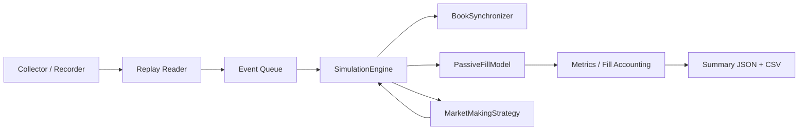

# lob_sim

`lob_sim` is a Python research simulator for Binance USD-M futures book/tick replay, explicit event-driven matching, and market-making strategy experiments.

## What this version covers

This repository now demonstrates five concrete capabilities:

1. Matching engine correctness (tick-time FIFO matching, order types, queue position, partial fills).
2. Event-driven architecture (order arrival/cancel/trade execution stream).
3. Market-making strategy layer (dynamic quotes, volatility-based spread, skew, queue-repost controls).
4. Reproducible experiment scripts (spread width, skew, latency, and drift-oriented adverse-selection runs with charts).
5. Cleanly documented assumptions, internals, and data structures (with architecture diagram).

## 1) Matching engine correctness

`lob_sim/sim/fill_model.py` implements an explicit matching engine model:

- Price-time priority is preserved with per-side FIFO deques at each tick level.
- Supported order types:
  - `limit` (resting post + passive matching)
  - `market` (immediate book sweep)
  - `cancel` (explicit cancel handling from strategy actions)
- Queue position tracking:
  - Strategy orders are tracked inside queue levels with explicit `queue_ahead_lots`.
  - Every fill resolves whether the order was filled from front (`queue_ahead_lots = 0`) or after queue consumption.
- Partial fills are supported whenever venue sweep quantity is greater than resting depth.
- Depth changes from replay are applied as level deltas, venue additions/removals are inserted into the matching structure at the correct side and tick.
- Queue positions and fills evolve tick-by-tick from the replay stream.

### Exposed book interfaces

From the matching layer and book:

- best bid/ask: `best_bid_tick()`, `best_ask_tick()`, `best_ticks()` (book side)
- spread / mid:
  - spread from `best_ticks()`
  - `mid_price()` from reconstructed venue book (`LocalOrderBook`)
- depth:
  - `depth_levels(symbol, side, levels=20)`
  - `best_bid_tick`, `best_ask_tick`

## 2) Event-driven architecture

The simulation loop is driven by a single event queue (`heapq`):

- `decision`  
  periodic strategy planning event (`mm_requote_ms`)
- `order_arrival`  
  delayed by `SIM_ORDER_LATENCY_MS`
- `order_cancel`  
  delayed by `SIM_CANCEL_LATENCY_MS`
- `trade_execution`  
  generated from `depthUpdate` / `aggTrade` fills and fed through the same event pipeline

Every event is processed in timestamp order, so the book evolves naturally at each market tick.

## 3) Market-making strategy layer

`lob_sim/sim/mm_strategy.py` adds a richer strategy module:

- Quotes at bid/ask around live mid.
- Spread expands/shrinks with realized short-horizon volatility:
  - `MM_VOLATILITY_SPREAD_FACTOR`
  - `MM_VOLATILITY_WINDOW`
- Inventory skew:
  - long inventory quotes more cautiously (ask wider / bid lower)
  - short inventory does the opposite
  - `MM_SKEW_BPS_PER_UNIT`
- Queue deterioration controls:
  - strategy reissues/reposts when queue ahead exceeds `MM_QUEUE_REPOST_LOTS`
- Integration with engine metrics:
  - outputs include fill rate, total/realized/unrealized PnL, max queue ahead, adverse fill metrics.

## 4) Experiment suite

`experiments/run_experiments.py` provides reproducible experiment scripts:

- `spread_width_sweep` → effect on PnL / fill rate
- `inventory_skew_sweep` → adverse selection vs skewing intensity
- `latency_impact` → queue impact of order/cancel latency
- `adverse_drift` → adverse-selection rate by mark-out drift regime (up/down)

Run:

```bash
python -m experiments.run_experiments --file data/raw_*.ndjson --env .env
```

Each run writes CSV + PNG artifacts into `experiments/output`.

## 5) Matching and data structure docs

### Core matching structures

- `LocalOrderBook` (`lob_sim/book/local_book.py`)  
  Reconstructed venue book from snapshots/diffs (for true exchange-like best/mid context).
- `PassiveFillModel` (`lob_sim/sim/fill_model.py`)  
  Matching/queue layer with FIFO queues per side/price:
  - `dict[str, dict[str, dict[int, deque[Order]]]]`
  - per-tick price levels store strategy + venue orders
- `SimulationEngine` (`lob_sim/sim/engine.py`)  
  Orchestrates event stream, routes market events into matching, emits decision/arrival/cancel/trade events.
- `MarketMakingStrategy` (`lob_sim/sim/mm_strategy.py`)  
  Strategy signal module, independent from execution concerns.
- `SimulationMetrics` (`lob_sim/sim/metrics.py`)  
  Tracks fills, PnL, markout/adverse-selection, inventory, queue behavior.

## Architecture (high-level)



## Limitations and assumptions

- Binance `aggTrade`/`depthUpdate` payloads are sampled/streamed from recorded data; all queue dynamics are reconstructed from this feed.
- Per-strategy orderbook model is explicit for a single bot per side (`bid/ask`) and focuses on strategy execution quality signals, not full venue participant simulation.
- Exchange-level queue estimates remain approximate where venue-only quantity changes are coarsely mapped into queue deques.

## Quick run

```bash
python -m lob_sim.cli collect
python -m lob_sim.cli replay --file data/raw_....ndjson
python -m lob_sim.cli simulate --file data/raw_....ndjson
```
