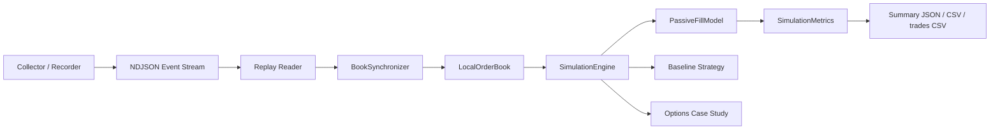

# lob_sim

lob_sim is a deterministic, validity-aware Binance USD-M market-by-price replay and execution-sensitivity laboratory for market-making research. A secondary controlled options case study is included for reservation price, inventory skew, signed markout, and hedging logic.

Fast reviewer links:

- [Interview Packet](docs/interview_packet.md): 60-second pitch, architecture, strongest files, assumptions, non-claims, and Q&A.
- [Reviewer Results Memo](docs/reviewer_results_memo.md): factual evidence summary, stress-pack counts, markouts, benchmark caveats, and limits.
- [Real Data Runbook](docs/real_data_runbook.md): collect, inspect, simulate, audit, benchmark, and publish larger public-data tape runs.
- [Fill Assumption Envelope](docs/fill_assumption_envelope.md): conservative/base/aggressive sensitivity for public-L2 passive-fill assumptions.
- [Claim / Non-Claim Matrix](docs/claims.md): the language this project can defend in a technical review.
- [Schema-v3 Architecture](docs/architecture_v3.md): envelope fields, validity epochs, and causal event priority.

## Overview

The repo has two artifacts:

- A futures core that records public Binance USD-M market data, reconstructs the local book from snapshots and depth diffs, and replays that stream through an event-driven queue-aware passive-fill simulation.
- A controlled options case study that keeps pricing and inventory logic explicit instead of claiming venue-calibrated options microstructure.

For a reviewer-focused path through the futures core, start with [docs/hft_reviewer_guide.md](docs/hft_reviewer_guide.md). For a condensed interview script, open [docs/interview_packet.md](docs/interview_packet.md).

Reviewer quickstart:

```bash
python scripts/reviewer_gate.py
```

For the factual results memo, open [docs/reviewer_results_memo.md](docs/reviewer_results_memo.md). The memo points to the real recorded clip, the synthetic stress pack, the larger-tape path in [docs/real_data_runbook.md](docs/real_data_runbook.md), the publication checklist in [docs/real_data_results_template.md](docs/real_data_results_template.md), benchmark commands, and limitations.

### Why this stands out

- Event-time replay rather than bar backtest.
- Explicit book reconstruction from `exchangeInfo`, `snapshot`, `depthUpdate`, and `aggTrade`.
- Explicit public-L2 execution scenarios with synthetic queue-ahead tracking; historical Binance participant FIFO is not claimed.
- Deterministic artifacts, reproducible runs, and a hash-based replay determinism checker for recorded NDJSON inputs.
- JSON-only checkpoint/resume for interrupted long replays, including active venue state, pending actions, markouts, accounting, strategy features, seeded latency state, and input/config identity checks.
- Line-numbered replay schema validation, stream inspection, and run manifests with input digests.
- Explicit assumptions, validation notes, and limitations instead of hidden realism claims.

## What Is Implemented

### Futures replay core

- Market-data capture into crash-visible segmented NDJSON via [`lob_sim/cli.py`](lob_sim/cli.py), [`lob_sim/record/async_writer.py`](lob_sim/record/async_writer.py), and [`lob_sim/record/segmented.py`](lob_sim/record/segmented.py).
- Schema-v3 capture metadata uses independent `public` depth and `market` trade routes, global receive sequence assigned before payload parsing, receipt monotonic time, stream/sync epochs, and stream-first snapshot bridging. Connect, disconnect, connect-failure, parse-failure, snapshot-attempt/rejection, and normal capture-trailer boundaries are explicit. Rejected snapshots preserve raw levels without rounding; structurally invalid responses become explicit rejection events rather than disappearing from the tape.
- Compression and disk I/O run on one dedicated writer thread behind a configurable hard bound. Queue overflow or sink failure aborts capture rather than silently dropping and continuing, leaves a recoverable `.partial` tail, and writes a sanitized hashed failure sidecar; successful manifests include queue/outstanding high-water, lag, and completion evidence. This is fail-closed backpressure behavior, not proof of zero venue-side loss or a completed 24-hour soak.
- Snapshot seeding plus diff-continuity checks in [`lob_sim/book/sync.py`](lob_sim/book/sync.py).
- Local book reconstruction in [`lob_sim/book/local_book.py`](lob_sim/book/local_book.py).
- Event-driven replay and offline simulation in [`lob_sim/replay/runner.py`](lob_sim/replay/runner.py) and [`lob_sim/sim/engine.py`](lob_sim/sim/engine.py).
- Shared replay-row adapter/normalization in [`lob_sim/replay/adapters.py`](lob_sim/replay/adapters.py) and [`lob_sim/replay/normalization.py`](lob_sim/replay/normalization.py), so replay, simulation, and benchmarks consume the same `InstrumentSpec`, snapshot, depth, and trade event contract.
- Queue-aware passive-fill attribution in [`lob_sim/sim/fill_model.py`](lob_sim/sim/fill_model.py).
- PnL, inventory, fee, markout, queue, and kill-switch metrics in [`lob_sim/sim/metrics.py`](lob_sim/sim/metrics.py), with fee assessment isolated in [`lob_sim/sim/fees.py`](lob_sim/sim/fees.py).
- Gross/net/fee PnL, missing-mark nullability, gap-invalidated markouts, arrival-time post-only/risk checks, and bounded event sinks are part of the reviewer contract. Ordinary `simulate` runs stream event, fill, and markout audits without retaining those rows, publish deterministic audit-chain hashes, and fail before a fill if the configured pending-markout cap is exhausted. The old full-detail path is available only through the explicit `--in-memory-export` fixture compatibility flag.
- Risk can optionally enforce `MM_MAX_PORTFOLIO_NOTIONAL` at modeled order arrival. A positive cap reserves absolute marked inventory plus every live and pending order across symbols, uses limit prices for order reservations, and fails closed when an existing exposure cannot be marked. The default `0` keeps the per-symbol lot cap only; the reservation is deliberately conservative and is not a margin model.
- `rust/lob_core` is the pinned, unsafe-free kernel boundary. The independent Python oracle and Rust agree on generated fixed-point book batches, exact-synthetic new/cancel/replace lifecycles, integer-nanosecond scheduler transitions, and per-symbol live-plus-pending lot reservations; the [committed report](docs/differential_results/rust_python_parity_v3.json) explicitly keeps full-engine parity false.
- Extension notes for future adapters and asset metadata in [`docs/extension_points.md`](docs/extension_points.md) and [`docs/tokenized_assets_roadmap.md`](docs/tokenized_assets_roadmap.md).

### Controlled options case study

- Black-Scholes fair value, reservation price, half-spread, signed markout, inventory skew, and delta hedging in [`lob_sim/options/demo.py`](lob_sim/options/demo.py).
- Deterministic committed sample outputs under [`docs/sample_outputs/`](docs/sample_outputs/).
- Same-seed scenario comparison and spread-vs-toxicity sensitivity sweeps in [`experiments/`](experiments/).

## Futures Replay Internals

- The collector writes a deterministic event stream of `exchangeInfo`, `snapshot`, `depthUpdate`, and `aggTrade` records to NDJSON.
- The replay path consumes that same recorded stream; there is no separate replay-only data format.
- The reader validates the replay contract before yielding events, so malformed rows fail with file and line context instead of leaking into simulation state.
- `InstrumentSpec` rejects empty symbols, non-positive tick/lot sizes, and non-finite multipliers at the adapter boundary before book or fill code sees them.
- Snapshot seeding uses the REST snapshot as the local book baseline, then requires the first accepted diff to cover the snapshot update id.
- Diff continuity is enforced with Binance USD-M `U`, `u`, and `pu` semantics; gap handling is explicit rather than patched over.
- With `RESYNC_ON_GAP=1`, live collection re-snapshots on continuity failure. Offline replay and simulation do not fabricate missing updates.
- Schema-v3 simulation uses market-data-first logical ties; legacy v1 rows retain an explicitly labeled action-first compatibility policy.

Run the futures paths with:

```bash
python -m lob_sim.cli --env .env.example doctor
python -m lob_sim.cli --env .env.example collect
python -m lob_sim.cli inspect --file data/capture_....manifest.json
python -m lob_sim.cli --env .env.example replay --file data/capture_....manifest.json
python -m lob_sim.cli --env .env.example simulate --file data/capture_....manifest.json
python scripts/check_futures_determinism.py --file docs/sample_outputs/futures_replay_walkthrough/input_fixture.ndjson --env .env.example
```

For feed-specific details, open [docs/binance_usdm_feed_semantics.md](docs/binance_usdm_feed_semantics.md).
For the replay schema, inspection output, and simulation manifest contract, open [docs/replay_contract.md](docs/replay_contract.md).


```mermaid
flowchart LR
  A["Collector / Recorder"] --> B["NDJSON Event Stream"]
  B --> C["Replay Reader"]
  C --> D["BookSynchronizer"]
  D --> E["LocalOrderBook"]
  E --> F["SimulationEngine"]
  F --> G["PassiveFillModel"]
  F --> H["Baseline Strategy"]
  G --> I["SimulationMetrics"]
  I --> J["Summary JSON / CSV / trades CSV"]
  F --> K["Options Case Study"]
```

## Matching Model

- [`lob_sim/sim/fill_model.py`](lob_sim/sim/fill_model.py) stores a synthetic queue-ahead at each visible price level; this is not historical Binance FIFO.
- Snapshot seeding loads visible venue depth as resting queue ahead of any strategy order at that level.
- Depth reductions can be selected as an optimistic sensitivity; the trade-only scenario uses public prints as its queue-consumption signal.
- Depth increases append new venue liquidity to the back of the queue at that price.
- `aggTrade` prints are used as an additional observed signal that queue was consumed at the traded price.
- Recent depth reductions and `aggTrade` prints at the same symbol, side, and price are netted before queue consumption so one public execution signal is not counted twice.
- Overlap-reconciliation credits expire through a global time-ordered heap, so one-sided tapes with ever-changing prices do not retain one stale queue per historical price. The run's `fill_assumption_diagnostics.overlap_credit_state` exposes the active bounded state.
- `--fill-profile conservative|base|aggressive` and `SIM_FILL_MODEL=trade|depth` make the public-L2 execution scenario explicit and mutually exclusive.
- Run summaries expose observed public-consumption lots, overlap-netted lots, modeled queue-consumption candidates, synthetic queue lots consumed, and unmatched lots for both public sources.
- Event traces include per-price `queue_consumption` rows tying each public depth/trade signal to the observed, netted, FIFO-consumed, and unmatched lots behind the summary totals.
- Trade-stream outages clear stale flow signals and invalidate live/pending execution state whenever the chosen fill or strategy scenario requires trades. Reconnect recovery starts a fresh prospective epoch; the still-valid depth book is not falsely marked broken, and pre-outage queue evidence cannot fill in the new epoch.
- Fill trace rows carry notional, fee, spread-capture, mid-at-fill, queue, and regime fields so a fill can be audited without leaving the event timeline.
- Markout summaries are split by fill source, so adverse selection can be inspected separately for depth-inferred, aggregate-trade, and taker-order fills.
- Event traces include `markout` rows when the post-fill horizon matures, tying each fill to the later mid, signed markout, adverse flag, and fill source.
- Queue-ahead tracking is explicit: a resting strategy order only fills after the modeled visible queue in front of it has been reduced.
- Strategy decisions are only scheduled after the book is synchronized and never before the snapshot timestamp that made buffered diffs usable; overdue decisions before the next market row use the prior book, while same-timestamp reactions run after that market row and any fills it produced.
- A strategy decision with no desired quotes pulls stale live quotes instead of silently leaving them in the book.
- Cancel latency is explicit: old quotes remain fillable until the modeled acknowledgement time, and a same-timestamp cancel acknowledgement is applied before the corresponding public market row.

See [docs/futures_validation.md](docs/futures_validation.md) for the assumptions that are currently tested.

## Strategy Layer (Baseline)

The strategy layer is deliberately baseline logic on top of a stronger replay and matching core. It is not presented as sophisticated alpha.

- Quotes are derived from the current best bid, best ask, and mid.
- Half-spread widens with short-horizon realized volatility.
- Inventory skew moves quotes away from accumulating too much position.
- Queue-based refresh logic reposts when queue-ahead deterioration or price movement makes the current quote stale.
- Max-position and kill-switch controls are explicit constraints, not optimization claims.
- The per-symbol lot cap is supplemented by an optional gross portfolio-notional reservation, so multi-symbol runs can bound inventory and outstanding quote risk without assuming offsetting fills.
- Event traces include queue-ahead-at-arrival and cancel reasons so queue-driven replacements can be audited without stepping through the simulator.
- Decision trace rows include quote diagnostics such as mid, volatility, spread inputs, imbalance inputs, fee floor, reservation tick, and gate label where relevant.

The baseline remains the default. Opt-in `layered_mm` and `research_mm` profiles add multi-level quoting, imbalance/toxicity controls, and for `research_mm` a reservation-price center plus fee-aware spread floor; see [docs/futures_strategy_profiles.md](docs/futures_strategy_profiles.md) and the committed-input comparison in [docs/strategy_results/futures_strategy_profile_reference.md](docs/strategy_results/futures_strategy_profile_reference.md).

## Metrics and Outputs

The default futures simulation creates one unique directory under `RECORD_DIR/outputs/` named
`run_<input>_<run_id>_<created_at>/` and writes:

- `summary.json`
- `summary.csv`
- `trades.csv`
- `markouts.csv`
- `event_trace.csv`
- `manifest.json`

Event, fill, and resolved-markout rows go directly to same-directory `.partial`
files with bounded memory. All three audits are flushed and fsynced before
promotion. `_INCOMPLETE.json` remains visible until the summaries and hashed
manifest are finalized, so an interrupted run cannot look complete. Raw clock
regressions in legacy tapes are recorded in trace details while exported rows
stay in normalized causal-time order. The JSON summary deliberately contains
`fills=null` and `markout_events=null`; the complete rows live in the CSV audits
and their canonical content is bound by the summary audit-chain hashes.

`--in-memory-export` preserves the old `summary_<stem>.*`, `trades_<stem>.csv`,
`event_trace_<stem>.csv`, and `manifest_<stem>.json` layout for small fixtures
and committed evidence generators. It is explicitly not bounded by tape length.

Tracked metrics include:

- realized and unrealized PnL
- replay event counts and book-sync gap counts observed during simulation
- event-time trace rows for market records, strategy decisions, scheduled arrivals, cancels, and fills
- risk-halt trace rows when configured kill-switch limits stop trading and clear live strategy state
- average spread captured
- quote-fill probability, fills per arrived order, fills per quote request, and fill-from-top rate
- queue-fill count and max queue ahead
- order lifecycle counts for scheduled arrivals, arrived quotes, resting outcomes, immediate fills, expired remainders, cancel requests, and cancel acknowledgements
- queue-ahead-at-arrival diagnostics for resting strategy quotes, separate from fill-time residual queue ahead
- per-fill attribution source (`depth_update`, `agg_trade`, or `taker_order`)
- summary-level fill-source counts so depth-inferred fills are visible without scanning every trade row
- public-consumption diagnostics that show how much depth/print consumption was modeled versus netted away
- summary and manifest instrument specs for venue, tick size, lot size, units, and contract multiplier
- summary and manifest simulation assumptions that state public-data limits and no private-fill truth claim
- fill-assumption profile/config labels for every futures simulation run
- self-trade prevention count for marketable strategy orders stopped before own resting liquidity
- per-fill fee rate, amount, and currency
- 1-second adverse markout statistics
- inventory mean and variability
- regime-bucket performance
- kill-switch state and reason

PnL, spread capture, markout, fees, and exported fill notional use the instrument `contract_multiplier`; inventory remains reported in normalized quantity units.

Validation notes live in [docs/futures_validation.md](docs/futures_validation.md). The replay determinism checker lives in [scripts/check_futures_determinism.py](scripts/check_futures_determinism.py) and compares canonical hashes of repeated in-memory summaries and event traces. Benchmark scope and the published reference run live in [docs/futures_benchmarks.md](docs/futures_benchmarks.md), human-readable benchmark output is in [docs/benchmark_results/futures_replay_reference.md](docs/benchmark_results/futures_replay_reference.md), and the lightweight runner lives in [experiments/benchmark_futures_replay.py](experiments/benchmark_futures_replay.py) with optional machine-readable JSON output via `--json-out`.
The pack auditor in [scripts/audit_futures_pack.py](scripts/audit_futures_pack.py) checks that futures packs' summary JSON/CSV, trades CSVs, event traces, markout audits, manifests, and public-data assumption contracts agree on replay event counts, fills, per-fill economics, lifecycle counts, public queue-consumption totals, markout events, audit-chain identities, per-file hashes, the content-addressed non-manifest bundle digest, and behavioral configuration/code identities. Legacy committed packs retain their compatibility audit; bounded bundles use an independent sequential-row oracle with a temporary on-disk SQLite index for exact evidence-ID and distinct-filled-order checks, so Python detail retention does not grow with tape duration.
The fill-assumption envelope runner in [experiments/run_fill_assumption_envelope.py](experiments/run_fill_assumption_envelope.py) runs conservative/base/aggressive assumptions on identical input/config except the fill profile and publishes a sensitivity report.
Parameter sweeps over committed fixtures live in [experiments/sweep_futures_parameters.py](experiments/sweep_futures_parameters.py). Latency sensitivity sweeps live in [experiments/sweep_futures_latency.py](experiments/sweep_futures_latency.py) and vary modeled order-arrival and cancel-ack delays without claiming latency-arbitrage or production gateway behavior.

## Verification And CI

Local green gate:

```bash
python scripts/reviewer_gate.py
make reviewer-gate
```

Equivalent narrower checks:

```bash
make ci
make determinism-fixture
make audit-futures-packs
make benchmark-fixture
make latency-sweep-fixture
```

`python scripts/reviewer_gate.py` is the cross-platform reviewer evidence path for shells without `make`; it runs tests, gradual mypy type checking over the replay/record/core CLI/simulation surface, Rust format/tests/Clippy, the committed [Python/Rust differential report](docs/differential_results/rust_python_parity_v3.json), committed-artifact verification, whitespace, committed-fixture determinism, committed futures pack audit, and the recorded-clip benchmark. The `make reviewer-gate` target delegates to the same script, and `make ci` delegates to `make reviewer-gate`. The checked-in GitHub Actions workflow installs dependencies, runs a CLI smoke test, then runs `make reviewer-gate` on Python 3.11, 3.12, and 3.13 to match the package metadata.
`make determinism-fixture` writes `outputs/futures_determinism.json` after proving the committed walkthrough fixture produces identical summary and event-trace hashes across repeated simulator runs.
`make audit-fixture` audits one configured pack; `make audit-futures-packs` audits both committed futures packs.
`make benchmark-fixture` writes `outputs/futures_benchmark.json` with input/config digests, p50/p99 loop timing, events/sec, memory, runtime, and source metadata.
`make latency-sweep-fixture` writes a local latency sensitivity table for the recorded futures clip.

To refresh the committed futures reviewer artifacts from a clean source tree, run:

```bash
make refresh-artifacts
```

That target uses one source-provenance snapshot for the walkthrough pack, recorded clip pack, strategy comparison, parameter sweep reference, and benchmark reference, so later generated files are not stamped dirty just because earlier generated files changed.

Committed futures walkthrough artifacts:

- Pack entry: [docs/sample_outputs/futures_replay_walkthrough/README.md](docs/sample_outputs/futures_replay_walkthrough/README.md)
- Summary: [docs/sample_outputs/futures_replay_walkthrough/summary.json](docs/sample_outputs/futures_replay_walkthrough/summary.json)
- Manifest: [docs/sample_outputs/futures_replay_walkthrough/manifest.json](docs/sample_outputs/futures_replay_walkthrough/manifest.json)
- Trades: [docs/sample_outputs/futures_replay_walkthrough/trades.csv](docs/sample_outputs/futures_replay_walkthrough/trades.csv)
- Event trace: [docs/sample_outputs/futures_replay_walkthrough/event_trace.csv](docs/sample_outputs/futures_replay_walkthrough/event_trace.csv)
- Notes: [docs/sample_outputs/futures_replay_walkthrough/walkthrough.md](docs/sample_outputs/futures_replay_walkthrough/walkthrough.md)
- Recorded clip case: [docs/sample_outputs/futures_recorded_clip_case/README.md](docs/sample_outputs/futures_recorded_clip_case/README.md)
- Strategy profiles: [docs/futures_strategy_profiles.md](docs/futures_strategy_profiles.md)
- Strategy profile reference: [docs/strategy_results/futures_strategy_profile_reference.md](docs/strategy_results/futures_strategy_profile_reference.md)
- Parameter sweep reference: [docs/strategy_results/futures_parameter_sweep_reference.md](docs/strategy_results/futures_parameter_sweep_reference.md)
- Latency sensitivity reference: [docs/strategy_results/futures_latency_sweep_reference.md](docs/strategy_results/futures_latency_sweep_reference.md)
- Stress evidence pack: [docs/sample_outputs/futures_stress_case/README.md](docs/sample_outputs/futures_stress_case/README.md)
- Fill assumption envelope: [docs/sample_outputs/futures_fill_assumption_envelope/README.md](docs/sample_outputs/futures_fill_assumption_envelope/README.md)
- Reviewer results memo: [docs/reviewer_results_memo.md](docs/reviewer_results_memo.md)
- Interview packet: [docs/interview_packet.md](docs/interview_packet.md)
- Larger real-data runbook: [docs/real_data_runbook.md](docs/real_data_runbook.md)
- Larger real-data results template: [docs/real_data_results_template.md](docs/real_data_results_template.md)

## Limitations

- Passive fills are inferred from public depth changes and `aggTrade` prints; they are not private exchange execution reports.
- Queue position is modeled at the visible price level, not from participant-level order identifiers.
- Offline replay does not reconstruct missing diffs after a gap; it reports the continuity failure and avoids inventing data.
- The strategy layer is a baseline quoting/control policy intended to exercise the replay and matching core.
- The repo is technical infrastructure and controlled case-study code, not a production venue gateway or production trading stack.

## Options Case Study

The second artifact is a controlled dealer-pricing case study. It is there to make fair value, reservation price, half-spread, signed markout, inventory skew, and hedging logic inspectable under fixed assumptions.

### Why synthetic / what real data would change

- The options artifact is synthetic by design so the pricing and risk logic stays legible.
- It is not a claim of venue-calibrated options microstructure or exchange-realistic options matching.
- Real data would primarily change flow calibration, surface fitting, markout behavior, and hedge-cost assumptions.

For the detailed calibration map, open [docs/what_real_data_would_change.md](docs/what_real_data_would_change.md).

### Commands and sample outputs

Neutral wrappers:

```bat
scripts\launchers\run_options_case_study.bat
```

```bash
bash scripts/launchers/run_options_case_study.sh
```

Additional convenience launchers:

```bat
scripts\launchers\run_options_mm_case.bat
scripts\launchers\run_options_mm_walkthrough_mode.bat
```

CLI:

```bash
python -m lob_sim.cli options-demo --scenario toxic_flow --steps 180 --seed 7 --out-dir outputs --brief --walkthrough-mode
python -m experiments.run_options_scenario_matrix --steps 180 --seed 7 --out-dir outputs
python -m experiments.run_options_toxicity_spread_sensitivity --steps 180 --seed 7 --out-dir outputs
```

Committed artifacts:

- Controlled case-study pack: [docs/sample_outputs/toxic_flow_seed7/](docs/sample_outputs/toxic_flow_seed7/)
- Scenario matrix: [docs/sample_outputs/scenario_matrix_seed7/scenario_matrix.md](docs/sample_outputs/scenario_matrix_seed7/scenario_matrix.md)
- Sensitivity sweep: [docs/sample_outputs/toxicity_spread_sensitivity_seed7/toxicity_spread_sensitivity.md](docs/sample_outputs/toxicity_spread_sensitivity_seed7/toxicity_spread_sensitivity.md)
- Options walkthrough notes: [docs/options_mm_demo_guide.md](docs/options_mm_demo_guide.md)
- Options case study notes: [docs/options_case_study_notes.md](docs/options_case_study_notes.md)

## Walkthrough Path

Start with [WALKTHROUGH.md](WALKTHROUGH.md).

Technical read, then zero-click futures artifacts, then the options case study:

1. `README.md`
2. `docs/binance_usdm_feed_semantics.md`
3. `docs/futures_validation.md`
4. `docs/sample_outputs/futures_replay_walkthrough/README.md`
5. `docs/sample_outputs/futures_replay_walkthrough/summary.json`
6. `docs/sample_outputs/futures_replay_walkthrough/trades.csv`
7. `docs/sample_outputs/futures_replay_walkthrough/walkthrough.md`
8. `docs/sample_outputs/futures_recorded_clip_case/README.md`
9. `docs/futures_strategy_profiles.md`
10. `docs/strategy_results/futures_strategy_profile_reference.md`
11. `docs/sample_outputs/toxic_flow_seed7/case_brief.md`
12. `docs/sample_outputs/scenario_matrix_seed7/scenario_matrix.md`
13. `docs/options_case_study_notes.md`

If you are browsing on GitHub and not running the code, start with [docs/sample_outputs/futures_replay_walkthrough/README.md](docs/sample_outputs/futures_replay_walkthrough/README.md).
Then open the recorded-data check in [docs/sample_outputs/futures_recorded_clip_case/README.md](docs/sample_outputs/futures_recorded_clip_case/README.md).
Then compare the baseline and layered profiles in [docs/futures_strategy_profiles.md](docs/futures_strategy_profiles.md) and [docs/strategy_results/futures_strategy_profile_reference.md](docs/strategy_results/futures_strategy_profile_reference.md).
Then use the committed options case-study pack in [docs/sample_outputs/toxic_flow_seed7/](docs/sample_outputs/toxic_flow_seed7/).
For the same-seed comparison, open [docs/sample_outputs/scenario_matrix_seed7/](docs/sample_outputs/scenario_matrix_seed7/).
For the deterministic spread-versus-toxicity sweep, open [docs/sample_outputs/toxicity_spread_sensitivity_seed7/](docs/sample_outputs/toxicity_spread_sensitivity_seed7/).
