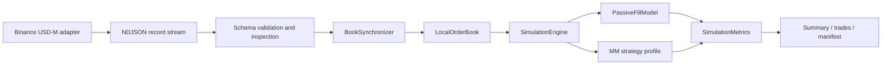

# HFT Reviewer Guide

## 60-Second Pitch

`lob_sim` is a deterministic Binance USD-M L2 capture/replay and queue-aware passive-fill simulator. The center of the repo is not alpha; it is infrastructure that proves careful thinking about book reconstruction, event-time replay, queue priority, public-data fill assumptions, adverse selection, inventory/risk metrics, reproducibility, and benchmark provenance.

The options material is secondary: a controlled dealer-pricing case study for reservation price, signed markout, and hedging logic under synthetic assumptions.

## What To Inspect First

1. [Replay contract](replay_contract.md)
2. [Binance feed semantics](binance_usdm_feed_semantics.md)
3. [Futures validation](futures_validation.md)
4. [Queue/fill model](../lob_sim/sim/fill_model.py)
5. [Simulation engine](../lob_sim/sim/engine.py)
6. [Futures walkthrough pack](sample_outputs/futures_replay_walkthrough/README.md)
7. [Recorded futures clip case](sample_outputs/futures_recorded_clip_case/README.md)
8. [Strategy profile comparison](strategy_results/futures_strategy_profile_reference.md)
9. [Benchmark notes](futures_benchmarks.md)
10. [Extension points](extension_points.md)

## Architecture



## Exact Commands

```bash
python -m lob_sim.cli --env .env.example doctor
python -m lob_sim.cli inspect --file docs/sample_outputs/futures_replay_walkthrough/input_fixture.ndjson
python -m lob_sim.cli --env .env.example replay --file docs/sample_outputs/futures_replay_walkthrough/input_fixture.ndjson
python -m lob_sim.cli --env .env.example simulate --file docs/sample_outputs/futures_replay_walkthrough/input_fixture.ndjson
python experiments/benchmark_futures_replay.py --file docs/sample_outputs/futures_recorded_clip_case/input_clip.ndjson --env .env.example --json-out outputs/futures_benchmark.json
python experiments/sweep_futures_parameters.py --file docs/sample_outputs/futures_recorded_clip_case/input_clip.ndjson --env .env.example --out-dir outputs/futures_sweeps
```

With `make` available:

```bash
make test
make inspect-fixture
make simulate-fixture
make benchmark-fixture
make sweep-fixture
```

## Observed vs Inferred

Observed:

- public snapshots;
- public depth diffs and sequence IDs;
- public aggregate trade prints;
- local event timestamps stored in the record stream.
- replay row counts, applied depth-change counts, and book-sync gap counts in simulation summaries.
- event-time traces of market records, decisions, scheduled arrivals, cancels, and fills in generated CSV outputs.

Inferred:

- passive fills from visible level reductions and trade-print consumption;
- queue position at price level, not participant-level identity;
- adverse selection from post-fill mid-price markout;
- fill source attribution from the observed or simulated event that produced the fill;
- net maker/taker fee impact from configured fee assumptions;
- strategy behavior under configured latency assumptions.

## Queue And Fill Assumptions

- Snapshot levels seed visible queue ahead of strategy orders.
- Depth increases append later venue liquidity behind existing resting orders at that price.
- Depth reductions consume FIFO from the front of a level.
- `aggTrade` prints are used as an additional conservative queue-consumption signal at the traded price.
- Recent depth/trade overlap at the same symbol, side, and price is netted before queue consumption to reduce public-feed double counting.
- Exported fills carry `fill_source` as `depth_update`, `agg_trade`, or `taker_order`.
- Cancel-before-fill races are modeled through event-time ordering and explicit cancel latency.
- Replacement quotes are not allowed to leapfrog pending cancel acknowledgements for the same slot.
- Marketable strategy limits and market orders are taker fills against visible depth, not maker fills.
- Fee assumptions are explicit maker/taker bps; rebates are negative fees and each exported fill includes fee rate, fee amount, and fee currency.

## Limitations

- Public L2 data cannot prove private exchange fills.
- Level reductions can be cancels, trades, or both; the simulator documents the attribution assumption instead of hiding it.
- No hidden liquidity, queue-jump, exchange matching-engine private IDs, or production order gateway.
- Strategy profiles are transparent controls for exercising the replay engine, not production alpha claims.
- `research_mm` adds reservation-price inventory skew, toxicity-sensitive spread, and a fee-aware spread floor for inspection; it is still a research profile, not a trading system.
- Benchmarks are machine/dataset specific and include Python overhead.

## What This Proves

- Event-time replay discipline.
- Feed-specific sequence handling and gap policy.
- Non-resync mode still records continuity gaps and skips gap-affected diffs instead of mutating the book.
- Queue mechanics implemented with explicit FIFO queues.
- Risk and fill-quality metrics beyond PnL.
- Run diagnostics that expose record counts and gap handling instead of hiding bad feed continuity.
- Event traces that make order/cancel/fill sequencing inspectable without a debugger.
- Reproducible artifacts with input/config/source manifests.
- Extensible boundaries for future venue adapters and asset metadata.
