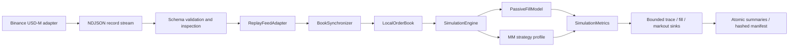

# HFT Reviewer Guide

## 60-Second Pitch

`lob_sim` is a deterministic, validity-aware Binance USD-M L2 capture/replay and execution-sensitivity laboratory. The center of the repo is not alpha; it is infrastructure that proves careful thinking about book reconstruction, receipt-time causality, synthetic queue-ahead assumptions, public-data fill uncertainty, adverse selection, inventory/risk metrics, reproducibility, and benchmark provenance.

The options material is secondary: a controlled dealer-pricing case study for reservation price, signed markout, and hedging logic under synthetic assumptions.

Repository shortcut paths: `docs/interview_packet.md`, `docs/real_data_runbook.md`, and `docs/real_data_results_template.md`.

## What To Inspect First

1. [Replay contract](replay_contract.md)
2. [Binance feed semantics](binance_usdm_feed_semantics.md)
3. [Futures validation](futures_validation.md)
4. [Replay adapter boundary](../lob_sim/replay/adapters.py)
5. [Replay normalization boundary](../lob_sim/replay/normalization.py)
6. [Queue/fill model](../lob_sim/sim/fill_model.py)
7. [Simulation engine](../lob_sim/sim/engine.py)
8. [Futures walkthrough pack](sample_outputs/futures_replay_walkthrough/README.md)
9. [Recorded futures clip case](sample_outputs/futures_recorded_clip_case/README.md)
10. [Strategy profile comparison](strategy_results/futures_strategy_profile_reference.md)
11. [Parameter sweep reference](strategy_results/futures_parameter_sweep_reference.md)
12. [Latency sensitivity reference](strategy_results/futures_latency_sweep_reference.md)
13. [Benchmark notes](futures_benchmarks.md)
14. [Determinism checker](../scripts/check_futures_determinism.py)
15. [Extension points](extension_points.md)
16. [Synthetic stress evidence pack](sample_outputs/futures_stress_case/README.md)
17. [Reviewer results memo](reviewer_results_memo.md)
18. [Architecture decisions](architecture_decisions.md)
19. [Interview packet](interview_packet.md)
20. [Larger real-data runbook](real_data_runbook.md)
21. [Real-data results template](real_data_results_template.md)

## Architecture



## Exact Commands

```bash
python scripts/reviewer_gate.py
python -m mypy lob_sim/audit lob_sim/book lob_sim/replay lob_sim/record lob_sim/cli.py lob_sim/config.py lob_sim/oracle_kernel.py lob_sim/util.py lob_sim/sim/fill_model.py lob_sim/sim/engine.py lob_sim/sim/export.py lob_sim/sim/runner.py lob_sim/sim/metrics.py lob_sim/sim/run_manifest.py lob_sim/sim/mm_strategy.py
python -m lob_sim.cli --env .env.example doctor
python -m lob_sim.cli inspect --file docs/sample_outputs/futures_replay_walkthrough/input_fixture.ndjson
python -m lob_sim.cli --env .env.example replay --file docs/sample_outputs/futures_replay_walkthrough/input_fixture.ndjson
python -m lob_sim.cli --env .env.example simulate --file docs/sample_outputs/futures_replay_walkthrough/input_fixture.ndjson
python scripts/check_futures_determinism.py --file docs/sample_outputs/futures_replay_walkthrough/input_fixture.ndjson --env .env.example
python scripts/audit_futures_pack.py --committed-futures
python experiments/benchmark_futures_replay.py --file docs/sample_outputs/futures_recorded_clip_case/input_clip.ndjson --env .env.example --mode all --pack docs/sample_outputs/futures_stress_case --json-out outputs/futures_benchmark.json
python experiments/sweep_futures_parameters.py --file docs/sample_outputs/futures_recorded_clip_case/input_clip.ndjson --env .env.example --out-dir outputs/futures_sweeps
python experiments/sweep_futures_latency.py --file docs/sample_outputs/futures_recorded_clip_case/input_clip.ndjson --env .env.example --out-dir outputs/futures_latency_sweeps
python scripts/refresh_futures_parameter_sweep_reference.py
python scripts/run_real_data_report.py --file data/capture_....manifest.json --env .env.real-data --label BTCUSDT_30m --publish-dir docs/real_data_runs
```

With `make` available:

```bash
make reviewer-gate
make ci
make test
make verify-artifacts
make inspect-fixture
make simulate-fixture
make audit-fixture
make audit-futures-packs
make determinism-fixture
make benchmark-fixture
make sweep-fixture
make latency-sweep-fixture
make refresh-artifacts
```

`python scripts/reviewer_gate.py` is the portable all-in local evidence gate; `make reviewer-gate` delegates to that same script. CI mirrors that local contract with a GitHub Actions matrix for Python 3.11, 3.12, and 3.13: each job installs the package with dev dependencies, runs a CLI smoke test, then runs `make reviewer-gate`. The mypy surface includes the bounded audit oracle, book, replay, record, CLI, independent Python oracle, deterministic simulation kernel, bounded export transaction, runner, metrics, manifests, sinks, and synthetic exchange/demo modules. `make refresh-artifacts` should be run from a clean source tree; it refreshes all committed futures reviewer artifacts with one source-provenance snapshot.

`python -m lob_sim.cli --env .env.example demo` adds a compact exact-synthetic
MBO proof to the public-L2 walkthrough. It shows the known maker order IDs,
price-time fill sequence, deterministic post-only rejection, transition log,
and final state hash. That result is ground truth only inside the synthetic
venue; the same output explicitly labels it as not historical Binance FIFO.

## Observed vs Inferred

Observed:

- public snapshots;
- public depth diffs and sequence IDs;
- public aggregate trade prints;
- local event timestamps stored in the record stream.
- adapter-normalized instrument metadata and integer tick/lot events, with positive tick/lot/multiplier checks before simulation state is created.
- generated summary and manifest `instrument_specs`, matching the replay input metadata used for units and multiplier economics.
- generated summary and manifest `simulation_assumptions`, explicitly stating public-data scope, synthetic queue-ahead assumptions, overlap netting, cancel-latency behavior, and no private execution-report claim.
- shared normalized replay events in integer ticks/lots before simulation code mutates state.
- replay row counts, applied depth-change counts, and book-sync gap counts in simulation summaries.
- event-time traces of market records, decisions, scheduled arrivals, cancel reasons, queue-ahead-at-arrival, book gaps, and fills in generated CSV outputs.
- risk-halt trace rows when the configured kill switch fires, including trigger reason and cleared live/pending strategy state.
- summary-level queue-ahead-at-arrival diagnostics, verified against event traces, so initial queue position is visible even when fill-time residual queue ahead is zero.
- strategy decision diagnostics: best ticks, mid, inventory, volatility, spread inputs, imbalance inputs, fee floor, reservation tick, and gate label where relevant.

Inferred:

- passive fills from visible level reductions and trade-print consumption;
- queue position at price level, not participant-level identity;
- adverse selection from post-fill mid-price markout;
- fill source attribution from the observed or simulated event that produced the fill;
- net maker/taker fee impact from configured fee assumptions;
- strategy behavior under configured latency assumptions.

## Queue And Fill Assumptions

- Snapshot levels seed visible queue ahead of strategy orders.
- Depth increases append later venue liquidity behind existing resting orders at that price.
- Depth reductions consume a synthetic queue-ahead from the front of a level only in the selected sensitivity scenario.
- In the selected trade-only scenario, `aggTrade` prints consume synthetic queue at the traded price; in the mutually exclusive depth sensitivity, displayed decreases do so instead.
- When a configured scenario observes both public signals for reconciliation diagnostics, recent same-symbol/side/price overlap is netted before modeled consumption to reduce double counting.
- `conservative`, `base`, and `aggressive` fill profiles make the passive-fill assumption explicit; the committed envelope sample is in [sample_outputs/futures_fill_assumption_envelope/README.md](sample_outputs/futures_fill_assumption_envelope/README.md).
- Queue-ahead state shown to the strategy is an observed copy, not mutable fill-state; refresh checks cannot accidentally add queue ahead.
- Exported fills carry `fill_source` as `depth_update`, `agg_trade`, or `taker_order`.
- Every exported fill carries `lob_sim.fill_provenance.v1`: scenario ID, resolvable input-record IDs, source-specific validity, synthetic queue trajectory, configured new/cancel latency draws, lifecycle state, and fee-model identity.
- The pack auditor resolves those record IDs against the hashed input and rejects inconsistent validity/queue identities or any claim that configured latency is measured latency.
- Summaries aggregate fill-source counts, so depth-inferred fills are visible without hand-reading `trades.csv`.
- Summaries split signed markout, adverse samples, and adverse-fill rate by fill source, so fill-quality diagnostics are not blended across modeled passive and explicit taker fills.
- Event traces emit post-horizon `markout` rows, making the later mid and adverse-selection flag auditable next to the original fill.
- Summaries report public-consumption diagnostics: observed depth/print lots, overlap-netted lots, modeled queue-consumption candidates, synthetic queue lots consumed, and unmatched lots when no internal level remained to consume.
- Event traces include `queue_consumption` rows for the per-price public consumption ledger behind those summary totals.
- Summaries aggregate order lifecycle counts for scheduled arrivals, arrived quotes, rested quotes, immediate fills, expired remainders, cancel requests, and cancel acknowledgements.
- Cancel-before-fill races are modeled through event-time ordering and explicit cancel latency.
- A no-quote strategy decision is a quote pull, not a no-op; existing live quotes are canceled through the same latency path.
- Replacement quotes are not allowed to leapfrog pending cancel acknowledgements for the same slot.
- During cancel latency the old quote remains fillable; a cancel acknowledgement at the exact timestamp of a public market row is applied before that row consumes queue.
- Strategy decisions are gated on synchronized books and never timestamped before the snapshot row that made buffered diffs usable; decisions due before a later market row are drained before that row, while same-timestamp reactions run after the row and its fills.
- Schema-v3 route failures are replayed as validity boundaries. A trade outage leaves an independently synchronized depth book intact but clears stale flow history and, when trades are required, terminates old orders/actions and blocks decisions until a fresh epoch connects. Summary `integrity.stream_state` and trace rows expose invalidation, ignored records, and recovery.
- Decision trace rows carry the strategy inputs and reason used to produce quote targets or pull quotes, so reservation-price and spread/gate logic can be inspected after the run.
- Marketable strategy limits and market orders are taker fills against visible depth, not maker fills.
- Self-trade prevention is conservative: a strategy taker order can consume venue liquidity, but stops before its own opposite-side resting order and expires the crossed remainder.
- Summaries include `self_trade_prevention_count`, and event traces flag the exact order arrival when prevention occurs.
- Fill trace rows include notional, fee, spread capture, mid-at-fill, time-in-book, queue, regime, and the complete provenance contract; committed artifact verification checks them as structured, cross-export evidence.
- Committed artifact verification checks event-trace row counts, contiguous sequence numbers, event-time ordering, structured `details` JSON, fill-row agreement with `summary["fill_count"]`, and order-lifecycle agreement with `summary["order_lifecycle_counts"]`.
- Fee assumptions are explicit maker/taker bps; rebates are negative fees and each exported fill includes notional, contract multiplier, fee rate, fee amount, and fee currency.
- PnL, spread capture, fees, and markout are contract-multiplier adjusted, while inventory remains in normalized quantity units.

## Limitations

- Public L2 data cannot prove private exchange fills.
- Level reductions can be cancels, trades, or both; the simulator documents the attribution assumption instead of hiding it.
- No hidden liquidity, queue-jump, exchange matching-engine private IDs, or production order gateway.
- Strategy profiles are transparent controls for exercising the replay engine, not production alpha claims.
- `research_mm` adds reservation-price inventory skew, toxicity-sensitive spread, and a fee-aware spread floor for inspection; it is still a research profile, not a trading system.
- Benchmarks are machine/dataset specific and include Python overhead.

## What This Proves

- Event-time replay discipline.
- Feed-specific sequence handling and gap policy.
- Non-resync mode still records continuity gaps and skips gap-affected diffs instead of mutating the book.
- Synthetic queue-ahead mechanics are implemented explicitly at each visible
  price level; this is not historical Binance participant FIFO.
- Risk and fill-quality metrics beyond PnL.
- Run diagnostics that expose record counts and gap handling instead of hiding bad feed continuity.
- Public-feed diagnostics expose how much depth/print consumption was modeled,
  consumed from the synthetic queue-ahead, left unmatched, or netted away.
- Event traces that make order/cancel/fill sequencing inspectable without a debugger.
- Risk-control traces that show when configured kill switches halt trading instead of silently suppressing later decisions.
- Queue-position summaries that distinguish "rested behind visible queue" from "filled after queue ahead was consumed."
- Reproducible artifacts with input/config/feed-adapter/source manifests.
- A CI-covered determinism checker that proves repeated in-memory fixture runs produce identical summary and event-trace hashes.
- A JSON-only simulation checkpoint contract that revalidates input/config identity and proves an interrupted continuation matches an uninterrupted replay; streaming sinks are not implicitly appended on resume.
- A futures pack auditor that checks replay input, summary JSON/CSV, trades, event trace, manifest, and public-data assumption agreement on event counts, fills, per-fill economics, lifecycle counts, public queue-consumption totals, markout event details, and output artifact hashes.
- A synthetic-but-exchange-shaped stress pack that intentionally covers queue ahead, partial fills, overlap netting, adverse/non-adverse markouts, cancel latency, same-timestamp cancel/trade ordering, marketable taker fills, self-trade prevention, and no-gap continuity.
- A deterministic latency sensitivity sweep that shows how modeled order-arrival and cancel-ack delays affect queue/fill outcomes without claiming a production latency edge.
- A fill-assumption envelope runner that compares fills, PnL, markouts, inventory, fill-source counts, and queue-consumption totals across conservative/base/aggressive public-L2 assumptions.
- Artifact verification rejects committed futures manifests refreshed from a dirty source tree.
- Artifact verification rejects committed futures packs whose summary, summary CSV, manifest, and replay-input instrument metadata disagree.
- Artifact verification rejects committed futures packs whose fill-assumption labels or public-data simulation assumptions are missing, inconsistent, or claim private exchange fills.
- Extensible boundaries for future venue adapters and asset metadata.
