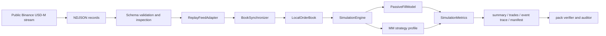

# Interview notes

## 60-Second Pitch

I built `lob_sim` around a simple question: what can public Binance USD-M L2
tell us about passive execution when it does not expose private order IDs or
exchange execution reports? It captures the feed, rebuilds valid book epochs,
replays events in receipt order, and runs queue, latency, cancellation, risk,
and accounting scenarios. Each modeled fill points back to its input records
and assumptions, and each run can be checked from its manifest and audit files.
A separate synthetic venue owns participant IDs and exact price-time matching,
so I can exercise FIFO mechanics without saying that public Binance data
contains them. This is execution research, not an alpha, profitability, or
production-gateway claim.

## Architecture



## Run it

```bash
python scripts/reviewer_gate.py
```

With `make` available:

```bash
make reviewer-gate
```

The command writes `outputs/reviewer_gate_report.json`: a compact handoff with
the tested commit, clean/dirty status, runtime/toolchain identity, each command,
result, and duration. CI uploads the same file. It records how the run was made;
it is not a trading-latency measurement.

## Where to look in the code

- `lob_sim/book/sync.py`: snapshot/diff continuity and gap policy.
- `lob_sim/record/async_writer.py`: hard-bounded off-event-loop capture persistence and fail-closed overflow/I/O semantics.
- `lob_sim/record/segmented.py`: checksummed segments, visible partial recovery, atomic finalization, and hashed writer evidence.
- `lob_sim/replay/adapters.py`: venue record normalization into instrument, snapshot, depth, and trade events.
- `lob_sim/sim/fill_model.py`: synthetic queue-ahead scenarios, passive/taker fills, public consumption, and self-trade prevention.
- `lob_sim/sim/synthetic_exchange.py` and `lob_sim/sim/synthetic_demo.py`: exact participant/order-level price-time matching and a compact ground-truth demo kept separate from public-L2 inference.
- `lob_sim/sim/engine.py`: event-time scheduling for market rows, decisions, arrivals, cancels, fills, and risk halts.
- `lob_sim/sim/metrics.py`: fill-source metrics, per-fill evidence/validity/queue/latency provenance, markouts, inventory, PnL, lifecycle counts, and public-consumption summaries.
- `scripts/audit_futures_pack.py`: resolves fill evidence against replay input and cross-checks summary, CSVs, event trace, trades, manifest, validity, queue trajectories, latency labels, provenance, per-file hashes, and the content-addressed bundle digest.
- `scripts/verify_committed_artifacts.py`: repository-level evidence gate.
- `docs/sample_outputs/futures_recorded_clip_case/README.md`: small recorded public-data proof point.
- `docs/sample_outputs/futures_stress_case/README.md`: synthetic stress pack for rare mechanics.
- `scripts/run_real_data_report.py`: local real-tape inspect/simulate/audit/benchmark/report pipeline with report-only docs publishing.
- `docs/real_data_runbook.md`: 10-30 minute real-tape run path.

## Historical real-data runs

The committed reports under `docs/real_data_runs/` are old regression material.
They predate stream-first capture, validity epochs, arrival-time risk checks, and
per-fill provenance, so their fill counts, PnL, and expanded traces are not
current results. A replacement report needs a schema-v3 capture, a complete
valid interval, resolvable `lob_sim.fill_provenance.v1` coverage, and a clean
pack audit.

## Assumptions in the model

- First diff must cover snapshot update id; later diffs must be continuous.
- Non-resync replay records gaps and avoids applying gap-affected book mutations.
- Snapshot visible quantity is queue ahead of strategy orders.
- The selected public-L2 scenario is explicit and mutually exclusive: confirmed trade prints consume synthetic queue in trade mode, while displayed decreases do so only in the optimistic depth sensitivity.
- Same-side depth/aggTrade overlap is netted before consumption.
- Cancel latency leaves old quotes fillable until acknowledgement.
- Same-timestamp ordering is explicit rather than universal: schema-v3 receipt-order ties apply market observations before same-time actions, while legacy coarse-timestamp rows retain action-first ordering as a labeled compatibility sensitivity.
- Marketable strategy orders are taker fills and cannot self-trade with own resting liquidity.
- Every fill's scenario, input records, validity, queue trajectory, latency draws, lifecycle state, fee model, economics, and output hashes agree across the summary, trades, and trace.
- Deterministic fixture runs produce identical summary and event-trace hashes.
- `python -m lob_sim.cli --env .env.example demo` prints the public-L2 result beside an exact-synthetic FIFO proof, with separate labels.

## What it does not tell you

- Private execution reports, participant-level queue IDs, or hidden-liquidity reconstruction.
- Production gateway behavior, colocated latency, or exchange certification.
- Alpha, Sharpe, profitability, or deployment performance.
- Venue-calibrated options microstructure.

## Questions I expect

### Why is this better than a bar backtest?

It keeps event ordering, book continuity, queue-ahead state, cancel latency, and fill attribution in the replay. The exported event trace lets a technical reader inspect the exact path from public depth/trade signal to modeled fill.

### How do you avoid overstating passive fills?

Fills are labeled as public-data queue inferences. The manifest records that no
private execution reports are present, the auditor checks the assumptions, and
the summaries leave unmatched public consumption visible instead of forcing
every level decrease into a fill.

### What happens on data gaps?

The synchronizer enforces Binance `U/u/pu` continuity. Live collection can resnapshot; offline replay reports the gap and does not invent missing diffs.

### Why include synthetic packs?

The recorded clip follows the path on public tape. The synthetic walkthrough and
stress packs keep rare mechanics compact and repeatable: overlap netting, cancel
races, taker fills, self-trade prevention, and adverse/non-adverse markouts.

### Why isn't the synthetic venue a Binance reconstruction?

The synthetic venue owns participant IDs, order IDs, and every state transition,
so price-time priority is ground truth inside that controlled mode. Binance
market-by-price data does not expose those private identities; the CLI demo
prints the two modes separately and labels the synthetic result explicitly.

### What would you add next?

Add more venues behind `ReplayFeedAdapter`, run longer public tapes with the real-data runbook, calibrate strategy parameters without claiming alpha, and optionally add private execution reports when a venue/account can legally provide them.
