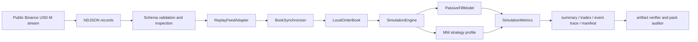

# Interview Packet

## 60-Second Pitch

`lob_sim` is a deterministic Binance USD-M public L2 replay and queue-aware passive-fill simulator. It records `exchangeInfo`, snapshots, depth diffs, and `aggTrade` prints; reconstructs the local book with explicit continuity checks; runs event-time strategy decisions, order arrivals, cancels, and fills through one timeline; and exports summaries, trades, event traces, and manifests that are audit-checked against the input. It does not claim alpha, profitability, private fill truth, or production latency. The signal is engineering discipline: replay correctness, explicit public-data assumptions, reproducibility, and reviewer-grade evidence.

## Architecture



## Exact Reviewer Command

```bash
python scripts/reviewer_gate.py
```

With `make` available:

```bash
make reviewer-gate
```

## Strongest Files

- `lob_sim/book/sync.py`: snapshot/diff continuity and gap policy.
- `lob_sim/replay/adapters.py`: venue record normalization into instrument, snapshot, depth, and trade events.
- `lob_sim/sim/fill_model.py`: FIFO visible-queue model, passive fills, public consumption, taker fills, and self-trade prevention.
- `lob_sim/sim/engine.py`: event-time scheduling for market rows, decisions, arrivals, cancels, fills, and risk halts.
- `lob_sim/sim/metrics.py`: fill-source metrics, markouts, inventory, PnL, lifecycle counts, and public-consumption summaries.
- `scripts/audit_futures_pack.py`: cross-checks replay input, summary, CSVs, event trace, trades, manifest, provenance, and hashes.
- `scripts/verify_committed_artifacts.py`: repository-level evidence gate.
- `docs/sample_outputs/futures_recorded_clip_case/README.md`: small recorded public-data proof point.
- `docs/sample_outputs/futures_stress_case/README.md`: synthetic stress pack for rare mechanics.
- `docs/real_data_runbook.md`: larger local real-tape run path.

## Assumptions Tested

- First diff must cover snapshot update id; later diffs must be continuous.
- Non-resync replay records gaps and avoids applying gap-affected book mutations.
- Snapshot visible quantity is queue ahead of strategy orders.
- Depth decreases and same-price public trade prints consume FIFO visible queue.
- Same-side depth/aggTrade overlap is netted before consumption.
- Cancel latency leaves old quotes fillable until acknowledgement.
- Same-timestamp cancel acknowledgements are applied before the corresponding market row.
- Marketable strategy orders are taker fills and cannot self-trade with own resting liquidity.
- Summary metrics match trace/trade rows and committed artifact hashes.
- Deterministic fixture runs produce identical summary and event-trace hashes.

## Not Claimed

- No private exchange execution-report truth.
- No participant-level queue IDs or hidden-liquidity reconstruction.
- No production gateway, colocated latency, or exchange certification.
- No alpha, Sharpe, profitability, or deployment claim.
- No venue-calibrated options microstructure.

## Likely Interview Q&A

### Why is this better than a bar backtest?

It keeps event ordering, book continuity, queue-ahead state, cancel latency, and fill attribution in the replay. The exported event trace lets a reviewer inspect the exact path from public depth/trade signal to modeled fill.

### How do you avoid overstating passive fills?

Fills are labeled as public-data queue inferences. The manifest states no private execution reports, the auditor checks the assumptions, and summaries expose unmatched public consumption instead of forcing every level decrease into a fill.

### What happens on data gaps?

The synchronizer enforces Binance `U/u/pu` continuity. Live collection can resnapshot; offline replay reports the gap and does not invent missing diffs.

### Why include synthetic packs?

The recorded clip proves the path on public tape. The synthetic walkthrough and stress packs make rare mechanics compact and deterministic: overlap netting, cancel races, taker fills, self-trade prevention, and adverse/non-adverse markouts.

### What would you do next for a desk-grade extension?

Add more venues behind `ReplayFeedAdapter`, run longer public tapes with the real-data runbook, calibrate strategy parameters without claiming alpha, and optionally add private execution reports when a venue/account can legally provide them.
